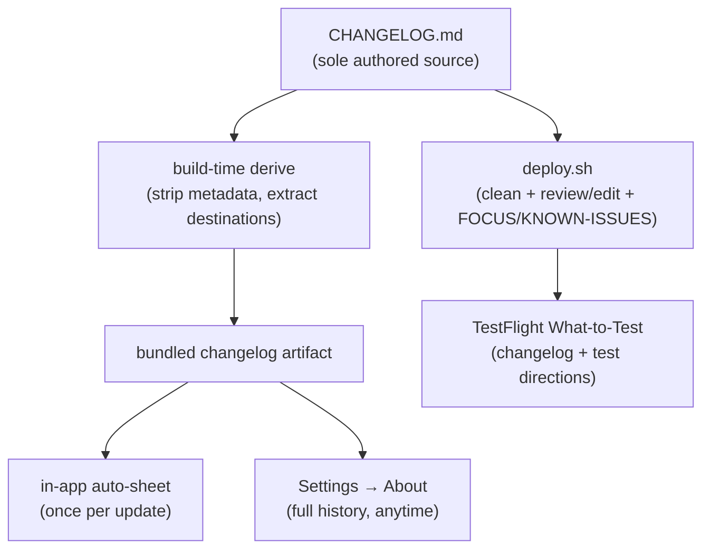

# Always-On Changelog — Requirements

## Summary

Drive a user-facing changelog from the `CHANGELOG.md` the repo already maintains, across two surfaces: an in-app "What's New" rendered as a DOS patch-notes artifact (an auto-sheet once per update plus a permanent Settings → About entry), whose entries can deep-link to the feature they introduced; and a `deploy.sh` step that pre-fills each TestFlight build's release notes from the changelog and lets the author add test directions before pushing. One authored source, no per-build authoring from scratch.

## Problem Frame

The repo keeps `CHANGELOG.md` with discipline — user-facing prose, `[Unreleased] → [Build N]` promotion at every bump — but that content stops at the repo. TestFlight testers never see it. The fields meant to carry it are left empty: writing release notes by hand was tried for builds 61 and 62 (DMNC-775, DMNC-790) and both tasks were filed then canceled. The lesson is that a recurring manual chore doesn't stick.

There's a second, app-specific cost. DOSBTS is feature-dense — predictive low alarms, day/night profiles, IOB splits, treatment cycles, the digest infographic — and testers (mostly the author, dogfooding, plus a small group) have no reliable way to discover what exists or what just landed. A changelog that reaches them is also the best feature-discovery surface the app has, refreshed every build.

## Key Decisions

- **Derive, never author.** Both surfaces derive from `CHANGELOG.md` so upkeep is automatic, not a per-build task. This is the direct fix for the abandoned manual-notes chore.
- **Persona from presentation, not rewrite.** Entry text renders verbatim with DOS visual treatment. The voice already lives in how the entries are written; a rewrite would create a second representation that drifts.
- **Pre-filled + editable, not a blind push.** The TestFlight field is pre-filled from the changelog (never empty) but passes through a read/edit checkpoint with a test-directions scaffold before it goes live.
- **Category-level deep links.** Linked entries navigate at tab / Settings-category granularity, not to an individual control — bounded routing that ships the feature tour without anchoring every control.
- **Intentional surface asymmetry.** The in-app changelog shows *what changed*; TestFlight shows *what changed plus what to test*. Test directions are ephemeral tester guidance and deliberately do not enter the permanent changelog.

---

## Requirements

**Single source of truth**

- R1. `CHANGELOG.md` is the sole authored source for both surfaces; no second changelog is maintained anywhere.
- R2. A build-time step derives a bundled, app-readable representation of the changelog so the in-app surface reads the bundled artifact at runtime, not the raw repo file. The bundled artifact reflects the build it ships in.
- R3. User-facing rendering strips developer metadata (the `— DMNC-NNN, PR #NN` suffixes) from every entry; the `### Added / Changed / Fixed / Removed` grouping is preserved.

**In-app "What's New" surface**

- R4. The app presents a "What's New" sheet once after an update — on the first launch where the running build is newer than the last build the user has seen.
- R5. The sheet shows every `[Build N]` block newer than the last-seen build, newest first; a user who skipped builds sees all intervening builds in one sheet.
- R6. On a fresh install (no prior last-seen build), the sheet does not present; the current build is recorded as seen silently.
- R7. The sheet is suppressed while a low or treatment-cycle alarm is active. Suppression defers rather than skips — the last-seen build is not advanced, so the sheet presents on a later launch when no alarm is active.
- R8. A permanent "What's New" entry lives in Settings → System & About, showing the full build history and openable anytime, independent of the auto-sheet.
- R9. Both surfaces use the DOS patch-notes treatment: a `PATCH NOTES · BUILD N` CRT banner, color-coded `Added / Changed / Fixed / Removed` section labels off the existing CGA palette, and the staged phosphor reveal used by the daily digest (static under Reduce Motion). Entry text renders verbatim.

**Deep-link feature tour**

- R10. A changelog entry may carry an optional destination marker that the build-time step extracts into an in-app navigation target and strips from the user-visible text.
- R11. Tapping a linked entry navigates at tab / Settings-category granularity (the 4 tabs and 6 Settings categories), reusing existing navigation (`.selectView` and the Settings drill-down). It does not scroll to an individual control.
- R12. Entries without a marker — including all fixes — render as plain, non-interactive entries.

**TestFlight release notes**

- R13. `deploy.sh` extracts the latest promoted `[Build N]` block, strips developer metadata, and pre-fills the build's TestFlight "What to Test" notes; the field is never left empty.
- R14. Before pushing, `deploy.sh` presents the pre-filled notes for review and edit, including a scaffolded `FOCUS THIS BUILD` / `KNOWN ISSUES` section for build-specific tester guidance.
- R15. The reviewed notes are pushed to App Store Connect via the ASC API the script already authenticates with; the push waits for the uploaded build to register in ASC before setting the notes.
- R16. Deploy-time edits and the test-directions layer apply to the TestFlight notes only; they are not written back to `CHANGELOG.md`.

---

## Source-of-truth fan-out

The two paths diverge on purpose: the bundled artifact carries only the permanent changelog; the deploy path layers ephemeral test directions on top for TestFlight (R16).

---

## Key Flows

- F1. First launch after an update
  - **Trigger:** App launches and the running build is newer than the last-seen build.
  - **Steps:** Check for an active low/treatment alarm; if active, defer (do not advance last-seen). Otherwise present the "What's New" sheet with every build block since last-seen, newest first, in patch-notes treatment. On dismiss, record the current build as seen.
  - **Outcome:** The user has seen what changed; linked entries can jump them to the relevant tab/category.
  - **Covered by:** R4, R5, R6, R7, R9, R11

- F2. Deploy with release notes
  - **Trigger:** Author runs `deploy.sh` after the `[Unreleased] → [Build N]` promotion and version bump.
  - **Steps:** Archive and upload as today. Extract the latest `[Build N]` block, strip metadata, pre-fill the notes buffer with a `FOCUS / KNOWN ISSUES` scaffold appended. Author reviews/edits. Poll ASC until the build registers, then push the notes.
  - **Outcome:** The build's TestFlight notes are populated automatically, with optional human-authored test directions; the field is never empty.
  - **Covered by:** R13, R14, R15, R16

---

## Acceptance Examples

- AE1. Fresh install
  - **Given** the app launches for the first time with no last-seen build recorded,
  - **Then** no "What's New" sheet presents and the current build is recorded as seen.
  - **Covers R6.**

- AE2. Skipped builds
  - **Given** the last-seen build is 104 and the running build is 107,
  - **When** the app launches with no alarm active,
  - **Then** the sheet shows builds 107, 106, 105 — newest first — in one presentation.
  - **Covers R5.**

- AE3. Alarm active at launch
  - **Given** the running build is newer than last-seen **and** a low alarm is active on launch,
  - **Then** the sheet does not present and last-seen is unchanged; it presents on a later launch when no alarm is active.
  - **Covers R7.**

- AE4. Fix-only entry
  - **Given** a changelog entry under `Fixed` with no destination marker,
  - **Then** it renders as plain text and is not tappable.
  - **Covers R10, R12.**

- AE5. Deploy review and edit
  - **Given** `deploy.sh` has pre-filled the notes from the latest `[Build N]` block,
  - **When** the author edits the buffer and fills the `FOCUS THIS BUILD` section,
  - **Then** the edited text is pushed to TestFlight only and `CHANGELOG.md` is unchanged.
  - **Covers R13, R14, R16.**

---

## Scope Boundaries

**Deferred for later**

- Exact-control deep links (scrolling to a specific toggle/row) — category-level routing ships first.
- A "coming next" / `[Unreleased]` teaser surface — set aside to avoid signalling unshipped work on a medical app.
- Feeding the DMNC-1120 showcase site from the same source — a plausible future synergy, but a separate repo and out of this scope.

**Outside this scope**

- Public App Store listing and App Store release notes — TestFlight-only for now (medical-device constraint); "App Store notes" means the TestFlight What-to-Test field today.
- AI/voice rewrite of changelog entries — presentation over rewrite (Key Decisions).
- A general Markdown rendering engine — entries render as styled native text, not parsed Markdown.
- Writing test directions back to `CHANGELOG.md`.

---

## Dependencies / Assumptions

- Assumes the existing CHANGELOG discipline holds (user-facing prose, `[Unreleased] → [Build N]` promotion at each bump, `— DMNC-NNN, PR #NN` suffixes) — the convention documented in `CLAUDE.md`.
- Assumes the `[Unreleased] → [Build N]` promotion happens before `deploy.sh` runs, so the latest `[Build N]` block is the build being shipped.
- Setting TestFlight What-to-Test via the ASC API requires the uploaded build to exist as a resource in ASC. This registration is fast (minutes) and is distinct from full build *processing*; the push polls for registration, not for processing completion.
- A new "last-seen build" value is persisted on the app state (per the established UserDefaults-backed state pattern); confirmed as net-new — no version-change detection exists today.

---

## Outstanding Questions

**Deferred to Planning**

- The form of the bundled changelog artifact (parsed JSON, copied Markdown, or generated Swift) and whether it is produced by a build phase or committed.
- The destination-marker syntax inside changelog entries — must coexist with Keep-a-Changelog formatting and strip cleanly from user-facing text.
- The enumerated destination set and how each maps to an existing navigation action (`.selectView` target or Settings category).
- The ASC registration poll's timeout and retry behavior in `deploy.sh`.

**Resolve Before Planning**

- None — product decisions were resolved in dialogue.
