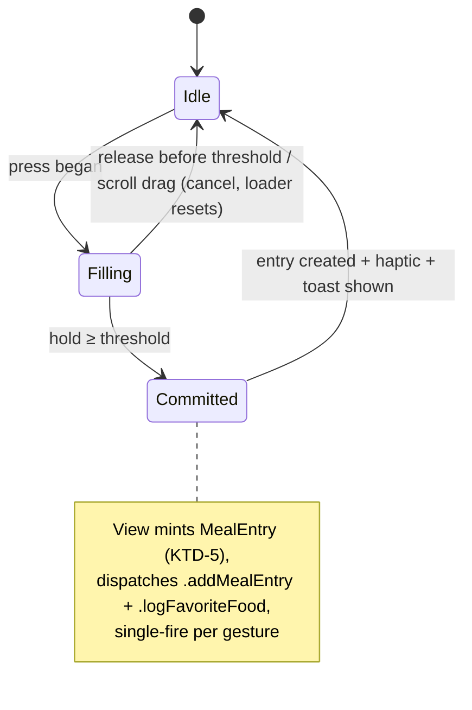

# feat: Unified entry interactions — tap-to-stage + hold-to-commit

**Issue:** [DMNC-796](https://linear.app/lizomorf/issue/DMNC-796)

## Summary

Implement the hybrid re-log vocabulary on both meal re-log surfaces (QUICK favourites, recents): tap routes to the staging plate, press-and-hold insta-logs after a countdown loader. Extract the toast into a shared component, migrate the QUICK chip to an `AmberChip` variant, and adopt `StepperField` in blood glucose entry.

## Problem Frame

The gesture model was decided in DMNC-805 (see origin) but never built: `logFavorite` in `App/Views/AddViews/UnifiedFoodEntryView.swift` still direct-logs on tap with no review step. The staging-plate rail, primitives, and toast all exist — this plan wires the decided behavior through them.

---

## Requirements

Carried from origin (same numbering). Gesture model: R1 favourite tap → pre-populated staging plate; R2 favourite hold → insta-log with countdown, early release cancels; R3 same tap/hold on recents; R4 hypo favourites stay 1-tap and exempt; R5 insta-log shows toast, staging path doesn't. Component: R6 reusable `HoldToCommitProgress`; R7 Reduce Motion fallback; R8 single shared hold-duration constant. Toast: R9/R10 shared toast preserving current shape and behavior (see KTD-2). Unification: R11 QUICK chip on an `AmberChip` variant; R12 `AddBloodGlucoseView` adopts `StepperField`.

Plan additions:

- R13. The hold gesture has a VoiceOver-accessible equivalent: a custom accessibility action ("Log immediately") on favourites chips and recents rows.
- R14. A scroll drag that interrupts a mid-fill hold cancels it (no log, loader resets).

---

## Key Technical Decisions

- **KTD-1 — Favourite tap reuses the DMNC-761 relog rail:** set `relogMeal = favorite.toMealEntry()`; the existing `.navigationDestination(item:)` push hydrates the plate via `.setFoodAnalysisResult`. No new Redux plumbing, and it satisfies the no-nested-sheets rule (`docs/solutions/ui-bugs/swiftui-nested-sheets-present-wrong-view-20260316.md`).
- **KTD-2 — Keep the shipped toast shape:** bottom-anchored, 3s auto-dismiss, UNDO. The origin's "slides from top, ~2s" came from the stale April issue; R10 (preserve behavior) wins. Extraction only, no redesign. (User-confirmed.)
- **KTD-3 — Hold replaces "Log Now" on recents:** remove the leading-swipe "Log Now" and the long-press `contextMenu` (it competes with the hold recognizer); "Add to Favorites" moves to a trailing swipe action. (User-confirmed.)
- **KTD-4 — `lastUsed` bumps at tap time:** dispatch `.logFavoriteFood` when a favourite is tapped to stage, even if the plate is later discarded. It is a sort heuristic, not medical data; threading favourite identity through the staging save isn't worth it. Hold-commit also dispatches it. (User-confirmed.)
- **KTD-5 — View creates the `MealEntry` at hold-commit:** the toast UNDO must hold the real UUID; never let middleware mint the entry (`docs/solutions/logic-errors/redux-undo-uuid-mismatch-middleware-creates-object-20260315.md`).
- **KTD-6 — Hold duration is one constant in `HoldToCommitProgress`:** start at 0.8s, tune on device. Reduce Motion via `@Environment(\.accessibilityReduceMotion)` — first use in the project; fallback is stepped/non-animated progress, threshold unchanged.
- **KTD-7 — No hold gesture in the hypo-filtered view:** tap is already instant there (R4); adding hold would slow treatment.
- **KTD-8 — `AmberChip` gains an additive `.quick` variant:** two-line content (label + carbs), intrinsic width capped ~120, tint-colored unselected stroke. `AmberChip` is public and compiles into the widget target — keep the variant free of app-only dependencies.
- **KTD-9 — `StepperField` binds display units for blood glucose:** mg/dL → step 1, range 40…500; mmol/L → step 0.1, converted range; convert back to Int mg/dL on save. No display-transform hook added to `StepperField`. `NumberSelectorView` stays untouched for `AlarmSettingsView` and `AddCalibrationView`.

---

## High-Level Technical Design

Hold-to-commit lifecycle (directional guidance, not implementation specification):

Tap/hold routing per surface:

| Surface | Tap | Hold |
|---|---|---|
| QUICK favourite (normal) | stage via `relogMeal` rail + `lastUsed` bump | insta-log + toast |
| QUICK favourite (hypo-filtered) | direct log (unchanged) | — none (KTD-7) |
| Recents row | stage (existing, DMNC-761) | insta-log + toast |

---

## Implementation Units

### U1. HoldToCommitProgress component

- **Goal:** Reusable press-and-hold commit control with countdown fill, cancel-on-release, Reduce Motion fallback.
- **Requirements:** R2, R6, R7, R8, R14.
- **Dependencies:** none.
- **Files:** `App/DesignSystem/Components/HoldToCommitProgress.swift` (new); `DOSBTSTests/HoldToCommitProgressTests.swift` (new — register in `project.pbxproj`: PBXBuildFile, PBXFileReference, `DOSBTSTests` group, `PBXSourcesBuildPhase`).
- **Approach:** Wraps content, drives a fill overlay from a `LongPressGesture(minimumDuration: holdDuration)`-based recognizer; commit callback fires once at threshold. Extract the timing/threshold logic into a testable pure helper (mirroring `StepperField.increment/decrement`'s static-helper pattern). Amber fill per design system; haptic via `DirectNotifications.shared.hapticFeedback()` at commit.
- **Patterns to follow:** `App/DesignSystem/Components/StepperField.swift` (static testable helpers, preview coverage), `AmberTheme` tokens.
- **Test scenarios:** progress(at:) maps elapsed/duration to 0…1 clamped; commit fires exactly once when elapsed ≥ threshold; release at 0.5× threshold → no commit, progress resets (Covers AE1); reduced-motion flag selects non-animated style with identical threshold (Covers AE2).
- **Verification:** previews show idle/filling/reduced-motion states; unit tests green.

### U2. Shared logged-meal toast

- **Goal:** Extract the toast from `UnifiedFoodEntryView` into a shared component with the caller-owned-entry UNDO contract.
- **Requirements:** R5, R9, R10.
- **Dependencies:** none.
- **Files:** `App/Views/SharedViews/LoggedMealToast.swift` (new); `App/Views/AddViews/UnifiedFoodEntryView.swift` (consume it, delete local toast code).
- **Approach:** Keep shape and timing verbatim (bottom overlay, 3s, `withAnimation(.linear(duration: 0.2))`, UNDO in cgaGreen). API takes the logged `MealEntry` and an undo closure; the component never dispatches `.deleteMealEntry` itself (KTD-5 contract — caller decides). Re-trigger while visible cancels the prior work item (existing behavior).
- **Patterns to follow:** existing `toastView`/`showToast`/`dismissToast` at `App/Views/AddViews/UnifiedFoodEntryView.swift` (move, don't rewrite).
- **Test scenarios:** UNDO invokes the caller closure with the same entry instance (Covers AE4); re-show replaces content and resets the dismiss timer. (View-model-level tests if logic is extracted; otherwise `Test expectation: none — pure view extraction, behavior pinned by U4 integration scenarios.`)
- **Verification:** existing favourites/recents toast behavior unchanged in the simulator.

### U3. Favourite tap routes to staging plate

- **Goal:** Replace `logFavorite`'s direct log with the staging route; preserve the hypo exception.
- **Requirements:** R1, R4.
- **Dependencies:** none (rail exists).
- **Files:** `App/Views/AddViews/UnifiedFoodEntryView.swift`; `DOSBTSTests/MealEntryRelogTests.swift` (extend).
- **Approach:** Non-hypo tap: dispatch `.logFavoriteFood` (KTD-4), set `relogMeal = favorite.toMealEntry()`. Hypo-filtered view (`filterToHypoTreatments == true`) keeps the current direct-log tap untouched. Favourites have no `analysisSessionId`, so hydration takes the single-aggregate-item branch — already covered by `MealEntry.toNutritionEstimate` fallback.
- **Test scenarios:** favourite→`toMealEntry()`→`toNutritionEstimate` yields one aggregate item carrying name and carbs (Covers F1); hypo favourite path unchanged (Covers AE3 / F3).
- **Verification:** tapping a QUICK favourite opens the plate pre-populated; Save logs, Discard doesn't; hypo sheet still 1-tap logs.

### U4. Wire hold-to-commit on favourites + recents

- **Goal:** Hold insta-logs on both surfaces; remove the now-conflicting "Log Now" affordances; accessibility parity.
- **Requirements:** R2, R3, R5, R13, R14.
- **Dependencies:** U1, U2, U3.
- **Files:** `App/Views/AddViews/UnifiedFoodEntryView.swift`.
- **Approach:** Wrap QUICK chips and recents rows in `HoldToCommitProgress` (skip in hypo-filtered view, KTD-7). Commit mints the entry in the view, dispatches `.addMealEntry` + `.logFavoriteFood` (favourites) or the `FavoriteFood.from(mealEntry:).toMealEntry()` round-trip (recents, as `logRecent` does today), shows the shared toast. Remove leading-swipe "Log Now" and the `contextMenu`; add trailing-swipe "Add to Favorites" (KTD-3). Add the custom accessibility action "Log immediately" on both surfaces.
- **Execution note:** Verify hold-vs-scroll interplay on device early — chips live in a horizontal `ScrollView`, recents in a `List`; no prior gesture art in this codebase.
- **Test scenarios:** Covers F2 / AE1: hold past threshold creates exactly one entry and shows toast; early release creates none. Covers AE4: toast UNDO deletes the held-logged entry (UUID match). Scroll drag mid-hold cancels (Covers R14, on-device check). VoiceOver custom action logs without the gesture (Covers R13). Recents hold round-trips through `FavoriteFood.from` for a fresh UUID/timestamp.
- **Verification:** on-device pass over both surfaces, normal + hypo sheets, VoiceOver on.

### U5. QUICK chip on AmberChip `.quick` variant

- **Goal:** Replace the hand-rolled QUICK chip with a shared `AmberChip` variant.
- **Requirements:** R11.
- **Dependencies:** U4 (avoid concurrent churn in the same view).
- **Files:** `Library/DesignSystem/Components/AmberChip.swift`; `App/Views/AddViews/UnifiedFoodEntryView.swift`; `DOSBTSTests/AmberChipTests.swift` (extend).
- **Approach:** Additive `.quick` variant case: two-line VStack (chipLabel + "Ng"), leading-aligned, lineLimit 1 + tail truncation, intrinsic width ≤ ~120, tint-colored stroke when unselected, existing tint parameter carries cgaGreen for hypo chips (KTD-8). Visual parity with today's chip is the bar, not a redesign.
- **Test scenarios:** `.quick` variant stores subtitle and tint; hypo chips render cgaGreen tint (snapshot or state assertion per existing AmberChipTests style).
- **Verification:** QUICK row visually unchanged (side-by-side screenshot), widget target still builds.

### U6. AddBloodGlucoseView adopts StepperField

- **Goal:** Replace `NumberSelectorView` with `StepperField` in blood glucose entry.
- **Requirements:** R12.
- **Dependencies:** none.
- **Files:** `App/Views/AddViews/AddBloodGlucoseView.swift`; `DOSBTSTests/` (extend an existing suite or add a conversion-helper test).
- **Approach:** Bind a `Double?` in display units (KTD-9): mg/dL step 1 range 40…500; mmol/L step 0.1 with converted range; convert to Int mg/dL in the add callback. `NumberSelectorView` keeps its other consumers.
- **Test scenarios:** mg/dL 100 round-trips to 100; mmol/L 5.5 converts to 99 mg/dL (via existing `toMmolL`/conversion extensions); empty field disables Add; range clamps at both bounds.
- **Verification:** add a blood glucose in both unit settings; stored values correct in Lists.

---

## Scope Boundaries

- Expand-from-tag, exercise entry, configurable hold duration, calibration view, motion polish beyond the loader — all out per origin Scope Boundaries.
- Insulin/blood-glucose hold gestures — no re-log surface exists (origin).

### Deferred to Follow-Up Work

- Capture a `docs/solutions/` learning on hold-gesture vs scroll-container interplay after U4 lands (no prior art in repo).
- VoiceOver/Dynamic Type audit of all new components belongs to DMNC-797; R13 is this plan's floor, not the full audit.

---

## Risks & Dependencies

- **Gesture/scroll conflict (highest risk):** long-press recognizers inside `ScrollView`/`List` can mis-fire or block scrolling; no in-repo prior art. Mitigation: U1 isolates the recognizer; U4's execution note front-loads on-device testing; fallback is gating hold to chips only (revisit with user if recents prove janky).
- **Toast UNDO race:** UNDO after the entry list reloads must still delete by UUID — covered by the caller-owned-entry contract (KTD-5).
- **Widget recompile surface:** `AmberChip` is shared with `DOSBTSWidget`; U5 must keep the variant dependency-free and verify the widget build.
- **CHANGELOG:** every unit except U1/U2 internals is user-visible — entries under `[Unreleased]` ride with the same PR (`Changed`: favourites tap stages instead of instant-logging, hold to insta-log; `Added`: hold-to-commit; `Changed`: blood glucose entry field).

---

## Sources & Research

- Origin: `docs/brainstorms/2026-06-10-unified-entry-interactions-requirements.md` (R/F/AE IDs referenced above).
- Relog rail: `App/Views/AddViews/UnifiedFoodEntryView.swift` (`relogMeal`, `openOnStagingPlate`), `App/Views/AddViews/FoodPhotoAnalysisView.swift` (`hydrateRelogIfNeeded`, `saveAnalysis`), `Library/Content/MealEntry.swift` (`toNutritionEstimate`), `Library/Content/FavoriteFood.swift` (`toMealEntry`, `chipLabel`).
- Learnings applied: `docs/solutions/ui-bugs/swiftui-nested-sheets-present-wrong-view-20260316.md` (KTD-1), `docs/solutions/logic-errors/redux-undo-uuid-mismatch-middleware-creates-object-20260315.md` (KTD-5), `docs/solutions/logic-errors/middleware-race-condition-guard-blocks-api-call-Claude-20260313.md` (no middleware guards on same-dispatch state; re-entry prevention lives in the gesture), `docs/solutions/logic-errors/redux-middleware-async-task-pitfalls-20260420.md` (toast/hold lifecycle stays in the view, not async middleware).
- Test conventions: `DOSBTSTests/DirectReducerTests.swift` (`makeTestDefaults()`), manual pbxproj registration for new test files (4 entries, pattern: `AmberChipTests.swift`).
