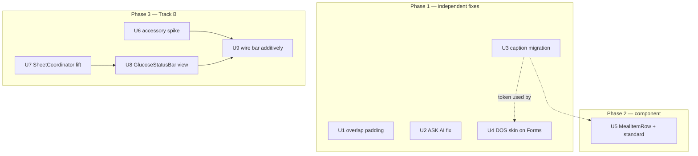

# feat: HIG/WWDC26 wave — entry-surface DOS unification + persistent glucose bar

## Summary

Track A: restyle the remaining system-gray entry forms onto the DOS skin (AddInsulinView is the reference), ship a shared meal-item component for recents + Lists, brighten informational captions from `amberDark` to `amber`, and fix the ASK AI first-tap bug. Track B: lift the sheet machinery to an app-root coordinator, then ship a persistent glucose + log-actions bar above the tab bar — additively, behind a theming spike, with Overview's buttons untouched until a dogfooding gate passes.

## Problem Frame

See origin for the full frame. In code terms: three Forms render system-gray (`AddMealView`, `AddBloodGlucoseView`, `AddCalibrationView`, plus `FoodPhotoAnalysisView`'s Form); `amberDark` measures 3.74:1 on black; the ASK AI `NavigationLink` needs 3–4 taps under an active search keyboard; Overview's `StickyQuickActions` sit behind the Liquid Glass tab bar; and every sheet in the app is private `@State` on `OverviewView` (8-case `ActiveSheet` + `pendingSheet` + treatment observers), which a TabView-level bar cannot reach.

---

## Requirements

From origin: R1/R1a/R2 (DOS skin + a11y floor on entry surfaces), R3/R4 (meal component + standard), R5 (caption legibility — **amended by user: existing `amber` token, no new token**), R6 (ASK AI first tap), R7/R7a/R7b (bar + gating spike + state table), R8/R8a (conditional routing + single presentation root), R9 (phased; Phase 2 removal deferred). Origin AE1–AE5 and F1–F3 are the acceptance anchors, with one amendment: **AE3's pass condition is "`AmberTheme.amber` measures ≥4.5:1 on black"** — no new token exists to measure.

---

## Key Technical Decisions

- **KTD-1 — Full sheet-enum lift to a root coordinator, with two present classes.** A `SheetCoordinator` (ObservableObject, injected at ContentView) owns the entire `ActiveSheet` enum — entry sheets, treatment modal/recheck, *and* the chart-marker sheets — plus `pendingSheet` dismiss-then-present sequencing and the treatment observers (cold-launch check, `showTreatmentPrompt`, `recheckDispatched`). Partial lifts leave two presentation roots, recreating the sibling-sheet bug class (`docs/solutions/ui-bugs/swiftui-nested-sheets-present-wrong-view-20260316.md`). Chart taps route through the coordinator via the existing callback closures. **Present semantics:** *safety presents* (`treatmentModal`, `treatmentRecheck`) **preempt** — they replace the active sheet immediately, matching today's observer behavior where the treatment modal swaps in over anything (a queued safety prompt a hypo user never sees is the failure mode); *ordinary presents* follow the pendingSheet path. Contention policy: at most one pending sheet per class, safety always survives a collision; duplicate present requests (same case id as active or pending) are ignored.
- **KTD-2 — Caption legibility uses the existing `amber` token.** (User decision at synthesis.) Informational captions migrate `amberDark` → `amber` (~9:1 on black); the 12pt-vs-17pt size split carries hierarchy. `amberDark` keeps its dimming/disabled role untouched. The audit classifies each call site; widget usages (`Widgets/WidgetDesignSystem.swift` consumers) migrate in tandem for the same roles only.
- **KTD-3 — Bar content is container-agnostic; the container is spike-gated.** `GlucoseStatusBar` is a plain view. U6 decides its host: `tabViewBottomAccessory` if the capsule carries DOS theming, else a custom `safeAreaInset` bar. Either way R7–R10 semantics are identical, so a fallback is a one-line swap, not a redesign.
- **KTD-4 — The bar reads the hero's state, not a copy.** Same `store.state` properties (`latestSensorGlucose`, staleness derivation, `treatmentCycleActive`) — no second timer, no cached value. The staleness presentation logic is extracted from the hero (`GlucoseView`) into a shared helper rather than duplicated.
- **KTD-5 — Overlap bug fixed first and independently.** `StickyQuickActions` gets correct bottom safe-area treatment in U1 regardless of Track B's fate (origin: the bug fix is not hostage to the bar).
- **KTD-6 — ASK AI is investigate-first.** Suspected: the `.searchable` keyboard swallows the first tap(s) before the `NavigationLink` activates. Fix direction (programmatic navigation on submit, keyboard pre-dismissal, or value-based `navigationDestination`) is chosen after reproducing with the keyboard up. No fix is committed in this plan.
- **KTD-7 — System chrome exempt from the skin.** Per origin R1: picker internals, keyboard, and menus keep system rendering; `.tint` applied where the API permits.

---

## High-Level Technical Design

Presentation architecture, before → after (KTD-1):

```mermaid
flowchart LR
    subgraph Before
        OV1[OverviewView] -->|"@State activeSheet (8 cases)\npendingSheet + treatment observers"| S1[.sheet]
        Bar1[bar — impossible:\nother tabs can't reach OV state]
    end
    subgraph After
        CV[ContentView] -->|hosts .sheet + observers| SC[SheetCoordinator\n@Published activeSheet/pendingSheet]
        OV2[OverviewView chart taps] --> SC
        BAR[GlucoseStatusBar\nany tab] --> SC
        TM[Treatment prompt/recheck\nobservers] --> SC
    end
```

Unit dependencies and phases:



The bar's state table (content per glucose/treatment state) is authoritative in origin R7b — U8 implements it verbatim.

---

## Implementation Units

### U1. Fix the tab-bar overlap on Overview

- **Goal:** `StickyQuickActions` fully visible above the Liquid Glass tab bar.
- **Requirements:** Origin R9 Phase 1 (bug-fix half).
- **Dependencies:** none.
- **Files:** `App/Views/OverviewView.swift`.
- **Approach:** The buttons already live in `.safeAreaInset(edge: .bottom)`; diagnose why they still underlap (likely the scroll content inset vs the inset view's own padding under iOS 26 Liquid Glass) and correct spacing/padding so the buttons clear the bar on device.
- **Test scenarios:** `Test expectation: none — pure layout; verified visually.`
- **Verification:** Simulator + device screenshot: buttons fully above the tab bar on Overview, including with the chart scrolled.

### U2. ASK AI first-tap fix

- **Goal:** First tap on the ASK AI row navigates and starts the query (origin R6, F3, AE5).
- **Requirements:** R6.
- **Dependencies:** none.
- **Files:** `App/Views/AddViews/UnifiedFoodEntryView.swift` (actionsSection ASK AI `NavigationLink`); test additions in `DOSBTSTests/` if logic is extracted.
- **Approach:** Reproduce with the search keyboard up; instrument which tap is consumed (keyboard dismissal, `.searchable` focus, or `NavigationLink` activation). Then pick the matching fix (KTD-6). Decide keyboard behavior and search-text retention during the investigation (origin Outstanding Questions).
- **Execution note:** Investigate and document root cause before changing behavior.
- **Test scenarios:** Covers AE5/F3: with keyboard up, one tap navigates and the query dispatches exactly once (no duplicate `.analyzeFoodText`). Guard still prevents re-dispatch when `foodAnalysisLoading` or a result exists.
- **Verification:** On-device: type query → single tap → analysis screen with loading state; no double-dispatch in logs.

### U3. Caption legibility migration (existing token)

- **Goal:** Informational small text reads at AA contrast; dimming/disabled semantics untouched (origin R5 as amended, AE3).
- **Requirements:** R5.
- **Dependencies:** none.
- **Files:** audit-driven across `App/Views/**` (~140 `amberDark` sites) and `Widgets/*.swift` (~31 sites); no design-system API change.
- **Approach:** Audit every `AmberTheme.amberDark` / `WidgetColors.amberDark` use; classify: informational caption/secondary text → `amber`; intentional dimming, disabled states, decorative strokes/borders → stays `amberDark`. Verify the stale-data warning tier and other semantic-amber surfaces keep salience (origin precondition). Apply per-role, not blanket replace.
- **Test scenarios:** Contrast assertion test: `amber` on black ≥4.5:1 (pin the token's published value). Disabled-pattern spot check pinning the *combination*: a known dependent-control site (e.g. Nightscout URL rows) still renders `amberDark`-family color *with* `.opacity(0.4)` after the sweep — token-only assertions pass vacuously (Covers AE3's second clause).
- **Verification:** Side-by-side screenshots of Log Meal, Lists, Digest, Settings before/after; disabled controls visibly dimmer than enabled text.

### U4. DOS skin on the remaining system Forms

- **Goal:** `AddMealView`, `AddBloodGlucoseView`, `AddCalibrationView`, and `FoodPhotoAnalysisView`'s Form render black/amber/monospace (origin R1, R1a, R2, AE1).
- **Requirements:** R1, R1a, R2.
- **Dependencies:** U3 (captions in restyled forms use the migrated color).
- **Files:** `App/Views/AddViews/AddMealView.swift`, `AddBloodGlucoseView.swift`, `AddCalibrationView.swift`, `FoodPhotoAnalysisView.swift`.
- **Approach:** Mirror `AddInsulinView`'s treatment (`.scrollContentBackground(.hidden)`, black background, amber rows, `DOSTypography`); keep native pickers/steppers (system chrome exempt, KTD-7). Apply the a11y floor: ≥44pt targets, VoiceOver labels on custom-styled controls.
- **Patterns to follow:** `App/Views/AddViews/AddInsulinView.swift` (the migrated reference), `App/Views/Settings/` category screens (List restyling idiom).
- **Test scenarios:** `Test expectation: none — styling; pinned by AE1 visual check.` (Any control-logic extraction gets unit tests if it occurs.)
- **Verification:** AE1: open each form — no system-gray grouped surfaces outside exempt chrome; VoiceOver reads each control meaningfully.

### U5. MealItemRow shared component + component standard

- **Goal:** One meal-item component with documented per-context variants replaces the bespoke rows in recents and Lists (origin R3, R4, AE4).
- **Requirements:** R3, R4.
- **Dependencies:** U3 (uses migrated caption color).
- **Files:** `App/Views/SharedViews/MealItemRow.swift` (new); `App/Views/AddViews/UnifiedFoodEntryView.swift` (recents); `App/Views/Lists/MealEntryListView.swift`; `docs/design-system.md` (component-standard checklist section — extend, no sibling doc); `DOSBTSTests/MealItemRowTests.swift` (new — register in pbxproj: 4 entries).
- **Approach:** Variants: `.recent` (compact, rides inside `HoldToCommitProgress`) and `.list` (timestamp + macro detail). Affordances are caller-supplied, not baked in: optional callbacks (`onLogAgain`, `onAddToFavorite`, `onDelete`) — the `.list` context attaches swipe/context-menu affordances from all three; the `.recent` context passes only `onAddToFavorite` because a context menu cannot coexist with the hold recognizer (DMNC-796 KTD-3). Component handles: name-only / name+carbs / long-name truncation (lineLimit + tail) / Dynamic Type growth. Digest timeline stays flat text (origin scope boundary). The standard section documents layout, type scale, color roles, tap targets as a self-certify checklist.
- **Test scenarios:** Variant stores context + renders carbs string when present, omits when nil; long-name truncation property (label string unchanged, rendering clipped — assert via the component's display-model if extracted). Covers AE4: both call sites construct the same component with their documented variant.
- **Verification:** Recents and Lists visually consistent; digest unchanged; checklist section present in `docs/design-system.md`.

### U6. Accessory theming spike (gates Track B's container)

- **Goal:** Decide accessory vs fallback with evidence (origin R7a).
- **Requirements:** R7a.
- **Dependencies:** none (can run first in Phase 3).
- **Files:** spike branch only; findings recorded in this plan's PR description and `docs/solutions/` if surprising.
- **Approach:** Prototype `tabViewBottomAccessory` with black background + amber monospace content. **Required first step, not a question:** restructure ContentView so the TabView is the outermost receiver — `LoadingView(GeometryReader/ZStack)` wrapping it will not propagate the accessory preference; the `appIsBusy` loading overlay becomes a ZStack layer on top of the TabView instead. Then: (a) test against the existing opaque `UITabBarAppearance` override; (b) screenshot `.inline` and `.expanded` environments; (c) check `tabBarMinimizeBehavior` interplay. Outcome: accessory passes → U9 uses it; fails → U9 uses a custom `safeAreaInset` bar (KTD-3).
- **Test scenarios:** `Test expectation: none — spike; deliverable is the decision + screenshots.`
- **Verification:** Documented go/no-go with screenshots on iOS 26 simulator + the 15 Pro.

### U7. SheetCoordinator — lift the sheet machinery to the root

- **Goal:** Single app-level presentation root for all sheets (origin R8a, AE2a).
- **Requirements:** R8a.
- **Dependencies:** none (parallel with U6).
- **Files:** `App/Views/SheetCoordinator.swift` (new — `ActiveSheet` made internal, coordinator ObservableObject); `App/Views/ContentView.swift` (host `.sheet(item:)`, treatment observers, inject coordinator); `App/Views/OverviewView.swift` (drop private sheet state; chart-tap callbacks call the coordinator); `App/Views/ListsView.swift` (its top-level AddBloodGlucose `.sheet` migrates to the coordinator's existing `.bloodGlucose` case — it is a second presentation root today); `DOSBTSTests/SheetCoordinatorTests.swift` (new — pbxproj registration, 4 entries).
- **Approach:** Move the 8-case enum, `pendingSheet` sequencing, cold-launch treatment check, and the `showTreatmentPrompt`/`recheckDispatched` observers to ContentView scope, implementing the KTD-1 present classes (safety preempts; ordinary pends; dedup by case id; safety wins pending collisions). The two stillLow observers collapse into one derived decision — `.treatmentCycleStillLow` sets both flags in one reducer transition and must yield exactly one present (recheck wins when both fire). Until U9 ships the bar, a safety present also dispatches `.selectView(overviewViewTag)` (matching the existing snooze-notification precedent in App.swift) so the user lands where the treatment banner lives. **Explicitly excluded:** sheets presented from *within* sheets stay in place (UnifiedFoodEntryView's favourites management, FavoriteManagementView's edit sheet, FoodPhotoAnalysisView's consent/camera) — lifting those to the root would invert the nested-sheet rule. The calibration screens' top-level sheet (`CustomCalibrationView`) stays local this wave but gets a characterization row (safety present over it).
- **Execution note:** Characterization-first — record today's behavior for every matrix row before the lift, including: recheck fires while the meal sheet is open (today: preempts), `.treatmentCycleStillLow` double-flag (today: one sheet wins the same-transaction write), recheck fires while user is deep in Settings/Digest/Lists, and kill-app-mid-cycle → relaunch.
- **Test scenarios:** Coordinator unit tests: present sets activeSheet; dismissThenPresent stages and promotes on dismiss; ordinary present while a sheet is up pends; **safety present while an ordinary sheet is up preempts immediately** (Covers AE2a — and pins that safety prompts are never queued behind user sheets); stillLow double-flag fixture yields one present and an empty pending; pending collision (ordinary staged, safety requested) drops the ordinary, never the safety; duplicate present (same id as active/pending) is a no-op.
- **Verification:** Full characterization matrix green before/after — 8 sheet flows + cross-tab firing rows + kill/relaunch row; full test suite green (baseline 262 plus the new tests landed so far this wave).

### U8. GlucoseStatusBar view

- **Goal:** The bar's content view: glucose + trend + MEAL/INSULIN actions, all seven origin-R7b states, conditional hypo routing (origin R7, R7b, R8, AE2, F1, F2).
- **Requirements:** R7, R7b, R8.
- **Dependencies:** U7 (routes through the coordinator).
- **Files:** `App/Views/SharedViews/GlucoseStatusBar.swift` (new); shared staleness helper extracted from `App/Views/Overview/GlucoseView.swift` into `Library/Content/` (testable, KTD-4); `App/Views/Overview/GlucoseView.swift` (adopt the helper; its 5–14 min stale tier currently renders `amberDark` — align the tier color with U3's audit decision so hero and bar never disagree on stale salience); `DOSBTSTests/GlucoseStatusBarTests.swift` (new — pbxproj registration, 4 entries).
- **Approach:** Implement the R7b state table verbatim; actions ≥44pt; MEAL routes `treatmentCycleActive ? .filteredFoodEntry : .meal` (origin R8 — explicitly new behavior), INSULIN → `.insulin`. Layout for `.inline` and `.expanded` accessory environments with origin's truncation priority (value never truncates → buttons → trend drops first). DOS styling inside whatever container hosts it.
- **Test scenarios:** State-mapping unit tests for all seven R7b rows (input: state fixture → expected bar mode). Covers AE2/F2: routing returns the filtered sheet case when `treatmentCycleActive`. Staleness helper: ≤5min fresh, 5–14 amber, 15+ red — same thresholds the hero uses (pin shared constants).
- **Verification:** Preview matrix of all states in both environments; routing verified in simulator.

### U9. Wire the bar additively

- **Goal:** Bar visible on all four tabs; Overview buttons remain (origin R9 Phase 1, F1).
- **Requirements:** R7, R9 Phase 1.
- **Dependencies:** U6 (container decision), U8 (bar view; transitively requires U7's coordinator).
- **Files:** `App/Views/ContentView.swift` (+ `App/Views/LoadingView.swift` if the U6 restructure lands here).
- **Approach:** Mount per U6's outcome (accessory or `safeAreaInset` fallback). The bar never minimizes while `treatmentCycleActive` (origin R7b); outside cycles, collapse behavior follows U6 findings (origin open question — resolve with the spike evidence). CHANGELOG entries for the whole wave ride with their units.
- **Test scenarios:** Integration check (simulator walk, not unit): bar present on all tabs incl. Settings; opening MEAL from Digest logs end-to-end (F1); treatment prompt firing while a bar-opened sheet is up resolves via the coordinator (AE2a, manual).
- **Verification:** F1/F2 walked on device; Overview shows both buttons and bar without layout conflicts.

---

## Scope Boundaries

- Settings content, native tab bar chrome, Claude AI path: untouched (origin).
- Digest timeline meal rendering: stays flat text this wave.
- No iOS 27 target bump.

### Deferred to Follow-Up Work

- **Overview button removal (origin R9 Phase 2):** only after the hypo-ergonomics gate — ≥44pt confirmed, no minimize during cycles, one real dogfooding cycle. File as a follow-up issue when the bar ships.
- **Digest timeline adoption of MealItemRow** (origin fork, resolved "not now").
- **Track C — on-device AI:** Linear DMNC-1023 (High), fully specified there.
- `docs/solutions/` learning on the accessory spike findings if they surprise.

---

## Risks & Dependencies

- **U7 is the riskiest unit** — it moves safety-relevant treatment flows. Mitigation: characterization-first execution note, full manual sheet-flow matrix, coordinator unit tests.
- **U6 may fail the theming bar** — KTD-3 makes the fallback a container swap; R7–R10 semantics unchanged.
- **U3's audit breadth** (~171 call sites: ~140 App + ~31 Widgets; exclude `Library/DesignSystem` token definitions themselves) — per-role classification prevents the blanket-replace failure modes the doc review flagged (disabled states, hierarchy, stale-warning salience).
- WWDC research underpinning the accessory API is days old; U6 validates empirically rather than trusting documentation.

---

## Sources & Research

- Origin: `docs/brainstorms/2026-06-11-hig-wwdc26-adoption-requirements.md` (six-persona reviewed; R7b state table lives there).
- Code grounding: `App/Views/ContentView.swift` (LoadingView wrapper, UITabBarAppearance, 4-tab TabView); `App/Views/OverviewView.swift` (`ActiveSheet` 8 cases, `pendingSheet`, treatment observers, `StickyQuickActions` in `safeAreaInset`); `App/Views/AddViews/{AddMealView,AddBloodGlucoseView,AddCalibrationView,FoodPhotoAnalysisView}.swift` (system Forms); `App/Views/Lists/MealEntryListView.swift` + `UnifiedFoodEntryView.swift` recents (bespoke meal rows); `AmberTheme.amberDark` 3.74:1.
- Learnings applied: `docs/solutions/ui-bugs/swiftui-nested-sheets-present-wrong-view-20260316.md` (KTD-1).
- WWDC 2026: [`tabViewBottomAccessory`](https://developer.apple.com/documentation/swiftui/view/tabviewbottomaccessory(isenabled:content:)/) confirmed current; [Adopting Liquid Glass](https://developer.apple.com/documentation/TechnologyOverviews/adopting-liquid-glass).
