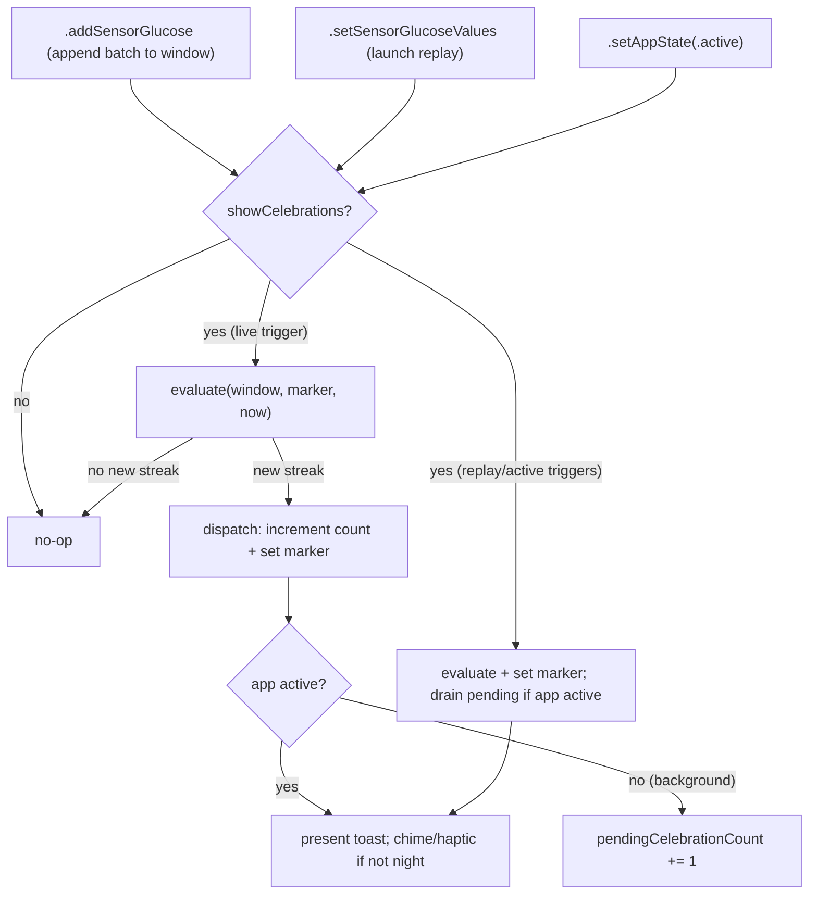

# feat: Tight-Control Streak Celebration

## Summary

Add a reward moment for sustained tight control: when sensor glucose holds 80–120 mg/dL for 2+ continuous hours, present a transient "TIGHT CONTROL" toast (chime + haptic, DOS amber styling), increment a persisted lifetime count shown on the STATISTICS view, gated by a Settings toggle (default ON), silent during night-profile hours, reduce-motion and VoiceOver aware. Implements Linear DMNC-772 (see origin: docs/brainstorms/2026-06-18-tight-control-streak-celebration-requirements.md).

---

## Problem Frame

DOSBTS only ever signals when something is wrong — alarms for highs, lows, predictive-low trends, sensor failures. There is no positive signal for doing well. This is the app's first reward loop: a small, low-key recognition for the hardest, most thankless stretches of glucose management. It adapts the DOOMBTS "secret area" mechanic to the DOS aesthetic while closing three gaps that reference left open (re-fire on relaunch, no quiet hours, no reduce-motion).

---

## Requirements

Carried from the origin requirements doc; see it for full rationale.

**Detection**
- R1. Detect when glucose stays within 80–120 mg/dL (inclusive, mg/dL internal value) for ≥2 continuous hours, evaluated as readings arrive.
- R2. A reading outside 80–120 breaks the in-progress streak; accrual restarts on the next in-band reading.
- R3. A data gap longer than the gap threshold breaks the in-progress streak.
- R4. After a celebration fires, the detector re-arms only after glucose leaves the band by the hysteresis margin for a sustained excursion; a single boundary blip does not re-arm.

**Celebration surfaces**
- R5. Present a transient "TIGHT CONTROL" toast in the DOS amber aesthetic, auto-dismissing after a few seconds, dismissible early by tap.
- R6. Pair the toast with a short chime and a success haptic, subject to R10 and the device mute switch.
- R7. Maintain a lifetime count of achievements, surfaced on the STATISTICS report view.

**Persistence & dedup**
- R8. Each qualifying streak produces at most one celebration and at most one count increment — no duplicate fire across backgrounding, kill, relaunch, or retroactive re-processing.
- R9. The lifetime count and dedup state survive app kill.

**Settings, quiet hours, accessibility**
- R10. During night-profile hours, celebrations are visual only — no sound, no haptic — evaluated at presentation time.
- R11. A "Celebrations" Settings toggle (default ON) gates the entire feature, including the deferred-presentation path.
- R12. Respect `UIAccessibility.isReduceMotionEnabled` (animation degrades to static/linear) and post a VoiceOver `.announcement` so the celebration reaches screen-reader users.

---

## Key Technical Decisions

- KTD1. Synchronous middleware, UserDefaults-only — no GRDB, no async. The count + dedup marker are scalar UserDefaults values, and detection runs as a pure scan over an in-memory readings window. This avoids the documented GRDB write-inside-asyncRead deadlock, Combine Future double-resume, and stale-async-state-snapshot bug classes entirely (see Sources).
- KTD2. Detection is a pure, replay-safe engine. A pure function over `(readings, lastCelebratedStreakStart, now, config)` returns whether to celebrate and the streak's start. It re-derives the current in-band run and re-arm eligibility from the readings each call; re-processing the same history with the same marker yields no new celebration. Mirrors the `IOBCalculator` engine pattern and is unit-tested in isolation.
- KTD3. Dedup identity = the in-band run's start timestamp. The only persisted detector state is `tightControlLastCelebratedStreakStart`. Fire only when the current qualifying run's start differs from the stored marker. A genuinely new run (after a real exit) has a new start and is naturally eligible; replayed identical history yields the same start and is deduped. Resolves the origin's deferred dedup-mechanism question.
- KTD4. Hysteresis re-arm = sustained exit, re-derived from history. After a celebration, a new run is eligible only if glucose left the band by ≥ the margin (default 5 mg/dL → below 75 or above 125) for ≥2 consecutive readings since the celebrated run. Because it is re-derived, no extra persisted flag is needed. Resolves the origin R4 single-blip-vs-margin ambiguity.
- KTD5. Detection config (resolves the origin's deferred R3/R4 questions): band 80–120, duration 2h, gap threshold `max(2 × sensorInterval, 12 min)` (two missed readings at the typical 5-min interval, rounded up to absorb delivery jitter), hysteresis margin 5 mg/dL × 2 readings. Thresholds are fixed, not user-configurable. Warmup exclusion is deliberately NOT implemented — see "Planning decisions beyond the brainstorm".
- KTD6. Build the evaluation window correctly per trigger. The `.addSensorGlucose` reducer updates only `latestSensorGlucose`, NOT `sensorGlucoseValues` (that array is set only by `.setSensorGlucoseValues` after an async GRDB reload). So on `.addSensorGlucose(glucoseValues:)`, the middleware must evaluate against `(state.sensorGlucoseValues + the action's batch)` sorted/deduped by timestamp — never the bare `state.sensorGlucoseValues`. On `.setSensorGlucoseValues` (launch/replay of the loaded ~24h window) the array is authoritative; scan it directly. Register the middleware in both `App.swift` arrays.
- KTD7. Presentation: foreground-immediate vs deferred. If the app is active when a new streak is detected on the live path, present immediately. Otherwise increment a persisted `pendingCelebrationCount` and present one consolidated "TIGHT CONTROL ×N" toast when the app is next foregrounded. Drain the pending count after the launch replay settles — handle the drain in the `.setSensorGlucoseValues` path (guarded by `appState == .active`), not on bare `.setAppState(.active)`, so a streak detected during the same launch's replay is presented that session rather than one cycle later. Sound and haptic are gated by `state.activeAlarmProfile` at presentation time (R10).
- KTD8. Toast hosted as a `ContentView` overlay (the `LoggedMealToastController` pattern hoisted to ContentView scope), never a row in `OverviewView`'s VStack — this avoids the documented VStack-overflow bug. The overlay must clear the per-tab `GlucoseStatusBar` (mounted via `safeAreaInset(edge: .bottom)`): anchor it with bottom clearance above that bar's height, or top-aligned below the status strip. The middleware cannot call the view controller directly — it flips an observable trigger that ContentView watches. Reduce-motion (R12) collapses the staged reveal to an immediate opacity change.
- KTD9. Settings home = Alarms & Alerts, beside the day/night schedule the quiet-hours rule reuses.

---

## Planning decisions beyond the brainstorm

The brainstorm deferred several questions to planning; these resolutions add or remove behavior the origin did not specify, recorded here for traceability.

- **Consolidated "×N" deferred toast (AE8)** — confirmed with the requester during the plan scope checkpoint. Multiple streaks completed while the app is closed collapse into one toast on next open; the lifetime count still rises by N. Requires the `pendingCelebrationCount` persisted field.
- **Re-enable consumes the current run (AE9)** — toggling Celebrations OFF then ON marks the in-progress run as already-celebrated so re-enabling cannot insta-fire mid-run. Closes a gap R11 left open.
- **Warmup exclusion dropped** — an earlier draft excluded sensor-warmup readings, but `SensorGlucose` carries no per-reading sensor-state field, so per-reading exclusion is not implementable, and the brainstorm never requested it. A 2h continuous in-band run starting inside the ~1h warmup is low-probability and low-harm. Deferred as an optional `sensor.state == .ready` middleware guard if dogfooding shows spurious warmup celebrations (see Open Questions).

---

## High-Level Technical Design

The detector is a pure function; the states below are *re-derived* from the readings window on each call, not stored (only the dedup marker persists).

```mermaid
stateDiagram-v2
    [*] --> Accruing
    Accruing --> Accruing: in-band reading (extends run)
    Accruing --> Accruing: out-of-band / gap (run resets, new start)
    Accruing --> FiredAwaitingRearm: run span >= 2h AND run.start != marker\n(fire; set marker = run.start)
    FiredAwaitingRearm --> FiredAwaitingRearm: still in band, or single blip out
    FiredAwaitingRearm --> Rearmed: >= 2 consecutive readings beyond margin\n(<75 or >125)
    Rearmed --> Accruing: in-band reading starts a new run
```

Trigger routing through the middleware — all three triggers pass the toggle guard first:

---

## Implementation Units

### U1. Persisted state, actions, and reducer

- Goal: add the feature's persisted state via the 4-file UserDefaults pattern plus the actions and reducer cases that mutate it.
- Requirements: R7, R8, R9, R11.
- Dependencies: none.
- Files: `Library/DirectState.swift`, `App/AppState.swift`, `Library/Extensions/UserDefaults.swift`, `Library/DirectReducer.swift`, `Library/DirectAction.swift`; test `DOSBTSTests/TightControlReducerTests.swift` (+ manual `DOSBTS.xcodeproj/project.pbxproj` registration — the tests target is not file-system-synchronized).
- Approach: four persisted properties — `showCelebrations: Bool` (default `true`, object-presence guard like `showPredictiveLowAlarm`), `tightControlStreakCount: Int` (default 0), `tightControlLastCelebratedStreakStart: Date?` (presence-guarded), `tightControlPendingCelebrationCount: Int` (default 0; backs the confirmed ×N deferred toast). Each gets a `didSet { defaults.x = x }` in `AppState` and a computed accessor in `UserDefaults` under the `libre-direct.settings.*` namespace. Actions: `setShowCelebrations`, a `tightControlStreakCelebrated(streakStart:)` the reducer handles by incrementing the count and setting the marker, and setters for the pending count. Exact action names are an implementation detail.
- Patterns to follow: `showPredictiveLowAlarm` (Bool-default-true 4-file chain); CLAUDE.md's GRDB-vs-UserDefaults guidance (scalars → UserDefaults).
- Test scenarios: reducer sets `showCelebrations` true/false; `tightControlStreakCelebrated` increments the count by one and stores the marker; pending-count setter round-trips; defaults are `true`/0/nil/0 on a fresh `AppState(defaults:)`; values survive a re-init with the same injected defaults. Covers AE8 (count) state.
- Verification: app + widget targets build; reducer tests pass; a fresh store reports the documented defaults.

### U2. Pure detection engine

- Goal: implement `TightControlStreakDetector` as a pure function encoding the state machine — accrual, gap break, 2h threshold, hysteresis re-arm, dedup, batch sorting, and clock-guard.
- Requirements: R1, R2, R3, R4, R8.
- Dependencies: none (pure; U3 consumes it).
- Files: `App/Modules/TightControlStreak/TightControlStreakDetector.swift` (app-only; single consumer, co-located with its middleware — tests use `@testable import DOSBTSApp`); test `DOSBTSTests/TightControlStreakDetectorTests.swift` (+ manual pbxproj registration).
- Approach: `evaluate(readings: [SensorGlucose], lastCelebratedStreakStart: Date?, now: Date, config:) -> (shouldCelebrate: Bool, celebratedStreakStart: Date?)`. Sort readings by timestamp; find the contiguous in-band run ending at the latest reading, where contiguity breaks on an out-of-band reading or a gap beyond the threshold; require the run's timestamp span ≥ 2h; require the run's start ≠ the marker; require re-arm satisfied (≥2 consecutive beyond-margin readings since the marker's run, or no prior fire). Inject `now`; never call `Date()` internally so tests are deterministic. All comparisons use reading timestamps, not wall clock; guard elapsed ≥ 0. The engine does not filter sensor warmup (see Planning decisions).
- Execution note: write the engine test-first — it is a pure function and mirrors `IOBCalculatorTests`.
- Patterns to follow: `IOBCalculator` / `IOBCalculatorTests`; `SparklineBuilder` (pure logic) for testable-engine structure.
- Test scenarios: Covers AE1 — 24 consecutive 5-min in-band readings → celebrate. Covers AE2 — fire, then one 121 reading then 118 → no re-fire even after a fresh 2h run. Covers AE3 — fire, then ≥2 readings above 125, then 2h in-band → second celebration. Covers AE4 — 90 min in-band, 40-min gap, resume → no fire until 2h re-accrues from the resumed readings. Covers AE5-engine — same input evaluated twice with the updated marker → second call yields no celebration (idempotent replay). Plus: exactly-2h boundary fires, 1h59m does not; empty history → no fire; unsorted batch handled; system-clock-backward (reading earlier than run start) → no fire; a historical date window whose run does not extend to `now` → no fire.
- Verification: engine tests pass; no `Date()` reference inside the engine.

### U3. Detection middleware and registration

- Goal: wire the engine to the store — observe the three triggers, build the correct window, apply the toggle guard, dispatch count/marker actions, and route presentation vs deferral.
- Requirements: R1, R5, R6, R7, R8, R9, R10, R11.
- Dependencies: U1, U2.
- Files: `App/Modules/TightControlStreak/TightControlStreakMiddleware.swift`; `App/App.swift` (append to both the simulator and device middleware arrays, same position — after `treatmentCycleMiddleware()`).
- Approach: guard `state.showCelebrations` on every handled action. On `.addSensorGlucose(glucoseValues:)`, evaluate against `(state.sensorGlucoseValues + the batch)` sorted/deduped by timestamp (the reducer has NOT appended the batch to `sensorGlucoseValues` — see KTD6). On `.setSensorGlucoseValues`, scan the array directly. On a new streak, dispatch the increment+marker action; then if the app is active, present immediately and play chime+haptic when `state.activeAlarmProfile != .night`; otherwise increment `pendingCelebrationCount`. Drain the pending count in the `.setSensorGlucoseValues` path (guarded by `appState == .active`) so a same-launch replay streak presents that session; also drain on `.setAppState(.active)` for a pending count set in a prior session. Present-and-clear must be atomic so a pending count is never shown twice. Handle `.setShowCelebrations(true)` by consuming the current in-band run (set the marker to its start) so re-enabling can't insta-fire mid-run. Add a cross-middleware comment noting `.addSensorGlucose` is also handled by `treatmentCycleMiddleware`/`glucoseNotificationMiddleware`.
- Patterns to follow: `TreatmentCycleMiddleware` (`.addSensorGlucose` + `.setAppState(.active)` shape, `LazyService` for an injected engine); reducer-runs-before-middleware ordering; "logic in middleware, not view `.onChange`" (middleware fires while backgrounded; `.onChange` does not).
- Test scenarios: toggle OFF → engine never consulted, no dispatch, and a pending count is NOT drained on `.setAppState(.active)` (R11 gates the deferred path too). Foreground live streak (batch crosses the 2h mark) → increment + present. Background streak → pending count incremented, no immediate present. Launch replay with a new streak while active → detected and presented in the same session (drain on `.setSensorGlucoseValues`). Covers AE6 — night profile at present time → no chime/haptic dispatched (visual only). Covers AE5 (end-to-end) — app closed during a streak → on `.setAppState(.active)`/replay exactly one toast presents and the pending count clears; a second foreground shows nothing. Covers AE7 — toggle OFF mid-run then a 2h window → no celebration. Covers AE9 — re-enable mid-run consumes the current run; next fresh run fires.
- Verification: both store factories compile; middleware tests pass; manual simulator run via the virtual connection produces exactly one toast per qualifying streak.

### U4. Celebration toast UI

- Goal: build the transient "TIGHT CONTROL" toast and host it above all tabs, clear of persistent surfaces, reduce-motion and VoiceOver aware.
- Requirements: R5, R6 (visual side), R10 (visual side), R12.
- Dependencies: U1, U3.
- Files: `App/Views/SharedViews/TightControlToast.swift` (controller + view); `App/Views/ContentView.swift` (hoist the `@StateObject` controller, overlay, and an `.onChange` observer of the middleware's present trigger). A new chime asset under `Library/Resources/` + a `NotificationSound` case only if an existing asset isn't reused.
- Approach: a `TightControlToastController: ObservableObject` with a `DispatchWorkItem` auto-dismiss (~4s) mirroring `LoggedMealToastController`, hoisted to ContentView scope (not a sheet). A `TightControlToastView` styled with `DOSTypography.displayMedium` in `AmberTheme.amberLight` (headline) with a `cgaCyan`/`cgaGreen` accent and glow — this reconciles the Summary/R5 "amber/cyan" intent; the exact accent token is a design call (Open Questions). Single-streak sub-line: "N HOURS IN RANGE"; consolidated (count > 1): show "×N" with no hours sub-line (streaks differ in length, so an hours figure would mislead). Mount via `.overlay` in ContentView, anchored to clear the per-tab `GlucoseStatusBar` (`safeAreaInset(.bottom)`) — bottom-aligned with clearance above the bar height, verified visually. Tap anywhere dismisses early (`onTapGesture { controller.dismiss() }`). Zero-state is U5's concern. Reduce-motion: read `@Environment(\.accessibilityReduceMotion)`; when on, use an opacity transition and set final state immediately. When motion is allowed, drive any staged reveal with an async-stepped `Task`, not same-tick `withAnimation` writes (they coalesce). Post a `UIAccessibility.post(notification: .announcement, ...)` from the controller's show path so VoiceOver users get the same signal as the visual/audio channels.
- Patterns to follow: `LoggedMealToast` / `LoggedMealToastController`; `ContentView` `scenePhase`/observer wiring; the same-tick-coalesce and reduce-motion learnings (see Sources).
- Test scenarios: toast display model renders "TIGHT CONTROL" with "N HOURS IN RANGE" for count 1 and an "×2" header with no hours sub-line for count 2; reduce-motion path selects the immediate/opacity branch; tap dismisses early. (View-level; the count value is reducer-tested in U1.)
- Verification: manual simulator run — toast appears clear of the bottom bar, auto-dismisses, dismisses on tap, respects reduce-motion, and posts a VoiceOver announcement.

### U5. STATISTICS lifetime-count card

- Goal: surface the lifetime count on the STATISTICS report view, independent of the statistics date window.
- Requirements: R7.
- Dependencies: U1.
- Files: `App/Views/Lists/StatisticsView.swift` (reusing `StatCard` from `Library/DesignSystem/Components/StatsComponents.swift`).
- Approach: `StatisticsView.body` is currently one `if let glucoseStatistics, maxDays >= 3` block, so an always-visible card requires restructuring the body into a `Group`/`@ViewBuilder` that emits an unconditional tight-control `Section` plus the existing stats block conditionally inside it; confirm the view is hosted in a `List` so the new `Section` insets correctly. The card reads `store.state.tightControlStreakCount`, shown when `showCelebrations` is on, regardless of `maxDays`. Zero-state: show "0" in `amberDark` (feature on, none earned yet); `cgaGreen` once the count > 0.
- Patterns to follow: `StatCard`, `UsageSection` in `StatisticsView`.
- Test scenarios: none — view wiring; the count value is reducer-tested in U1. (Test expectation: none — pure view composition of an already-tested state value.)
- Verification: manual run — the card shows the current count, increments after a celebration, is visible with fewer than three days of data, and reads "0" before the first streak.

### U6. Settings toggle

- Goal: add the "Celebrations" toggle (default ON) to Alarms & Alerts.
- Requirements: R11.
- Dependencies: U1, U3.
- Files: `App/Views/Settings/AlarmSettingsView.swift` (or the Alarms & Alerts category view it composes into).
- Approach: a `Toggle` bound to `store.state.showCelebrations`, dispatching `.setShowCelebrations`, with a subtitle like "Toast, sound, and lifetime count for tight-control streaks." The re-enable-consumes-run behavior lives in the middleware (U3), not the view.
- Patterns to follow: existing toggle rows in `AlarmSettingsView` (the UI side of the 4-file pattern).
- Test scenarios: reducer behavior is covered in U1; the consume-current-run-on-re-enable behavior is covered by U3's tests. (View wiring only here.)
- Verification: manual run — the toggle persists across launches; OFF suppresses all celebration surfaces including the deferred toast.

---

## Acceptance Examples

Origin AE1–AE7 are carried (see origin doc) and mapped to U2/U3 test scenarios above. Note the AE5 split: the engine-idempotency facet ("AE5-engine") is a U2 unit test, while the end-to-end deferred-presentation facet (origin AE5) is a U3 integration scenario. Two plan-introduced examples cover behaviors resolved during planning:

- AE8. Covers R7, R8. Two distinct streaks complete while the app is closed; on next open, exactly one consolidated "TIGHT CONTROL ×2" toast appears and the lifetime count has risen by two.
- AE9. Covers R11. With a 90-min in-band run already accrued, toggling Celebrations OFF then ON does not immediately fire; a celebration only fires after a fresh run reaches 2h.

---

## Scope Boundaries

**Deferred for later** (from origin)
- Configurable band/duration, multiple achievement tiers, per-day or current-streak displays beyond the single lifetime count.
- Live Activity / widget / lock-screen reflection of the achievement.
- A local-notification path for backgrounded achievements (traded away for the deferred toast; revisit only if dogfooding shows the deferred toast is too easy to miss).

**Outside this product's identity** (from origin)
- Streak-loss or "don't break it" messaging, countdown-to-failure framing.
- Leaderboards, social sharing, or comparison against other users.

---

## Risks & Dependencies

- Background BLE processing is assumed but unverified: if the connection layer does not dispatch `.addSensorGlucose` while backgrounded — or if `sensorGlucoseStoreMiddleware`'s `appState == .active` guard suppresses background reloads — detection effectively becomes foreground-only, with deferred celebrations surfacing on next launch via the `.setSensorGlucoseValues` replay. The replay window is the loaded ~24h (`DirectConfig.lastChartHours`); a streak completed more than ~24h before a relaunch is unrecoverable — an accepted boundary. This also affects re-arm: if a sensor swap trims `sensorGlucoseValues`, the ≥2-beyond-margin re-arm evidence can be lost; acceptable for a delight feature.
- Celebration after hypo recovery: a clean recovery to ~83 held in-band for 2h can fire a celebration shortly after the treatment "recovered" banner. This overlap is accepted by design (it rewards a genuine recovery-and-hold) — the brainstorm's "no treatment-cycle special-casing" decision stands; documented here so it isn't mistaken for a bug.

---

## Open Questions

Deferred to implementation:
- Final chime asset after listening — `achievement`, `positive`, or `coin-chime` (existing `.aiff`), or a new phosphor-chime asset.
- Exact toast accent token (`cgaCyan` vs `cgaGreen`), single-streak sub-line wording, auto-dismiss duration, and reveal timing.
- Exact names for the new Redux actions.
- Optional `sensor.state == .ready` middleware guard if dogfooding shows spurious warmup-period celebrations.

---

## Sources & Research

Reference implementation: DOOMBTS sibling fork (`../DOOMBTS`) — `GameMechanicsMiddleware` plus its brainstorm/plan. Carry the detection idea; drop the DOOM aesthetic and the in-memory closure-flag dedup (re-fires on relaunch).

Code breadcrumbs:
- Reducer reality (verified): `.addSensorGlucose` sets only `latestSensorGlucose`; `state.sensorGlucoseValues` is set by `.setSensorGlucoseValues` (async via `sensorGlucoseStoreMiddleware`) — see `Library/DirectReducer.swift`, `App/Modules/DataStore/SensorGlucoseStore.swift`.
- Middleware template + triggers: `App/Modules/TreatmentCycle/TreatmentCycleMiddleware.swift`; typealias `Library/Extensions/State.swift`; registration arrays `App/App.swift`.
- Reading model + state: `Library/Content/SensorGlucose.swift` (no per-reading sensor-state field); `state.sensorGlucoseValues`, `state.sensorInterval`, `state.sensor` on `Library/DirectState.swift` / `App/AppState.swift`.
- Night window: `resolveActiveAlarmProfile(at:)` in `Library/Content/AlarmProfile.swift`; `state.activeAlarmProfile`.
- Sound/haptic: `Library/DirectNotifications.swift` (`playSound`, `hapticNotification(.success)`); assets `Library/Resources/*.aiff`; enum `Library/Content/NotificationSound.swift`.
- Toast pattern + host: `App/Views/SharedViews/LoggedMealToast.swift` (note: instantiated inside a sheet — must be hoisted to `App/Views/ContentView.swift` scope); persistent bar `GlucoseStatusBar` via `safeAreaInset(.bottom)` (see `App/Views/Overview/OverviewView.swift`).
- Stats: `App/Views/Lists/StatisticsView.swift` (body fully inside the `maxDays >= 3` guard — restructure required); `StatCard` in `Library/DesignSystem/Components/StatsComponents.swift`.
- Settings + state pattern: `App/Views/Settings/AlarmSettingsView.swift`; the 4-file chain (`DirectState.swift`, `AppState.swift`, `Library/Extensions/UserDefaults.swift`, `DirectReducer.swift`); pure-logic engine pattern `IOBCalculator` + `IOBCalculatorTests`.
- Replay window bound: `DirectConfig.lastChartHours` in `Library/DirectConfig.swift`.

Institutional learnings that shaped the KTDs (all under `docs/solutions/`):
- `logic-errors/grdb-write-inside-asyncread-deadlock-20260420.md`, `logic-errors/combine-future-async-bridge-double-resume-20260420.md`, `logic-errors/grdb-future-nil-dbqueue-hangs-subscriber-20260318.md` → KTD1 (avoid GRDB/async entirely).
- `logic-errors/redux-middleware-async-task-pitfalls-20260420.md`, `logic-errors/middleware-race-condition-guard-blocks-api-call-Claude-20260313.md` → KTD2/KTD6 (synchronous, correct post-reducer state reads).
- `logic-errors/swiftui-onchange-dormant-when-backgrounded-20260424.md`, `logic-errors/appstate-inactive-blocks-data-loading-20260317.md` → KTD6/KTD7 (logic in middleware; drain after replay, not on bare `.onChange`/`.setAppState`).
- `ui-bugs/swiftui-vstack-overflow-sinks-safeareainset.md` → KTD8 (toast as ContentView overlay clear of the safeAreaInset bottom bar).
- `ui-bugs/swiftui-withanimation-same-tick-writes-coalesce.md` → U4 (async-stepped reveal + reduce-motion).
- `build-errors/xcode-filesystem-synchronized-migration-20260422.md` → U1/U2 new test files need manual pbxproj entries (baseline 308 tests).
- `best-practices/cross-repo-backport-workflow-20260418.md` → the DOOMBTS port classification.
