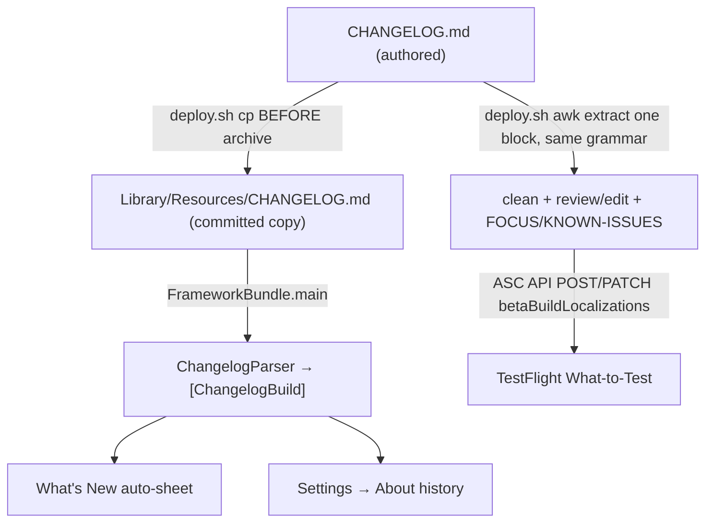

# feat: Always-On Changelog — in-app What's New + TestFlight release notes

## Summary

Drive a user-facing changelog from the existing `CHANGELOG.md` across two surfaces: an in-app "What's New" rendered as a DOS patch-notes artifact (an auto-sheet once per update plus a permanent Settings → About entry) whose entries can deep-link to the feature they introduced, and a `deploy.sh` step that pre-fills each TestFlight build's release notes from the changelog behind a read/edit gate and pushes them via the App Store Connect API. One authored source; no per-build authoring from scratch.

---

## Problem Frame

`CHANGELOG.md` is maintained with discipline but its content stops at the repo — TestFlight testers never see it, and the "What to Test" field is left empty (hand-authoring it was tried for builds 61 and 62 and abandoned). DOSBTS is also feature-dense, and testers (mostly the author plus a small group) have no reliable way to discover what landed. This plan turns the changelog the team already writes into the surfaces users actually see, with no recurring authoring chore (see origin: `docs/brainstorms/2026-06-20-always-on-changelog-requirements.md`).

---

## Requirements

Carried from the origin requirements doc; R-IDs preserved for traceability.

**Single source of truth**

- R1. `CHANGELOG.md` is the sole authored source for both surfaces; no second changelog is maintained.
- R2. A derived, app-readable representation of the changelog is produced from `CHANGELOG.md` so the in-app surface reads the derived artifact at runtime, reflecting the build it ships in.
- R3. User-facing rendering strips developer metadata (`— DMNC-NNN, PR #NN` and its variants); the `### Added / Changed / Fixed / Removed` grouping is preserved.

**In-app "What's New" surface**

- R4. The app presents a "What's New" sheet once after an update — on the first launch where the running build is newer than the last build the user has seen.
- R5. The sheet shows every `[Build N]` block newer than the last-seen build, newest first (capped on first screen per KTD11, with the remainder one tap away).
- R6. On a fresh install (no prior last-seen build), the sheet does not present; the current build is recorded as seen silently.
- R7. The sheet is suppressed while a low or treatment-cycle alarm is active; suppression defers (last-seen is not advanced) so it presents on a later alarm-free launch.
- R8. A permanent "What's New" entry lives in Settings → System & About, showing full build history, openable anytime.
- R9. Both surfaces use the DOS patch-notes treatment: a `PATCH NOTES · BUILD N` banner, color-coded section labels, and the digest's staged phosphor reveal (static under Reduce Motion); entry text renders verbatim.

**Deep-link feature tour**

- R10. A changelog entry may carry an optional destination marker, extracted into an in-app navigation target and stripped from user-visible text.
- R11. Tapping a linked entry in the auto-sheet navigates at tab / Settings-category granularity (4 tabs, 6 Settings categories); it does not scroll to an individual control.
- R12. Entries without a marker — including all fixes — render as plain, non-interactive entries.

**TestFlight release notes**

- R13. `deploy.sh` extracts the latest promoted `[Build N]` block, strips developer metadata, and pre-fills the build's TestFlight "What to Test" notes; the field is never empty.
- R14. Before pushing, `deploy.sh` presents the pre-filled notes for review/edit, including a scaffolded `FOCUS THIS BUILD` / `KNOWN ISSUES` section.
- R15. The reviewed notes are pushed via the ASC API the script already authenticates with; the push waits for the uploaded build to register in ASC.
- R16. Deploy-time edits and the test-directions layer apply to the TestFlight notes only; they are not written back to `CHANGELOG.md`.

---

## Key Technical Decisions

- KTD1. **Derived artifact = a committed copy of `CHANGELOG.md` at `Library/Resources/CHANGELOG.md`, parsed at runtime.** The project has no `PBXShellScriptBuildPhase` anywhere and a deliberately vendored/committed posture; authoring the project's first Run Script phase is higher-risk and out of character. `deploy.sh` refreshes the committed copy **before archiving** on every TestFlight build (the only builds users see), so the archived bundle carries the current changelog. Resolves the origin's "build phase or committed" question toward committed. Alternative (generate `changelog.json` via a separate parser) rejected to avoid a second parsing implementation; alternative (add a Run Script phase) deferred.
- KTD2. **One Swift parser (`ChangelogParser`) feeds the in-app surface; `deploy.sh` extracts its single build block with the same cleaning rules.** Shell can't call the Swift parser and the deploy path only needs one build's text, so it uses an `awk`/`sed` extraction that reproduces the parser's stripping. Both readers anchor on the `## [Build N]` block structure (never `[Unreleased]`) and strip the same trailing-metadata token set, including the `{tour:<key>}` token. **Metadata grammar (defined once, used by both):** strip a trailing run, after the last `—`, that begins with a known token — `DMNC-\d+`, `PR #\d+`, `R\d+`, `AE\d+`, `D\d+`, or `[A-Z]{2,}-\d+` — optionally followed by more issue refs, a trailing word (e.g. `follow-up`), and a period; never strip past an embedded prose em-dash, and never strip a trailing segment that lacks a known leading token. U7 diffs the shell-cleaned shipping block against the parser's output for that build before pushing, so the two implementations cannot drift (this is what makes the KTD1 single-source claim hold).
- KTD3. **Destination marker is a trailing `{tour:<key>}` token** placed before the `— DMNC` suffix, parsed into a `ChangelogDestination` and stripped from rendered text. `<key>` is a closed set (`overview`, `lists`, `digest`, `settings`, `settings/alarms`, `settings/glucose`, `settings/insulin`, `settings/sensor`, `settings/integrations`, `settings/about`). The token is pinned before U1 tests are written; final punctuation is implementation-adjustable.
- KTD4. **`lastSeenBuild: Int`, with `integer(forKey:)` returning `0` as the fresh-install sentinel.** `0` means "never seen anything" → record current, present nothing (R6). `DirectConfig.appBuild` is a `String`, so the caller guard-unwraps `Int(DirectConfig.appBuild)` and treats nil as a no-op (present nothing, do not advance last-seen). The present decision is a pure function `WhatsNewPresenter.shouldPresent(currentBuild:lastSeenBuild:alarmActive:)` so it unit-tests without `AppState`.
- KTD5. **Auto-present lives in the view layer (ContentView), triggered by `.onAppear` paired with `.onChange(of: appState)`.** `.onChange` alone misses a cold launch where the value is already `.active` at first render (documented learning). Presentation uses `SheetCoordinator.present(.whatsNew)` — an ordinary, deferrable present with a constant `id`, never `presentSafety` (reserved for treatment preemption). `lastSeenBuild` advances **at present time**, not on dismiss, so the deep-link dismiss path (which bypasses `onDismiss`) cannot leave it un-advanced.
- KTD6. **Deep-link taps dismiss-then-navigate; never open a nested sheet.** Nested `.sheet` from within a presented sheet presents the wrong view (documented). Links are an auto-sheet affordance only; in the Settings → About history (already inside the nav stack) entries render non-interactive, avoiding a broken back-path from a pushed view. Settings-category navigation is net-new: `.selectView` reaches the Settings tab, but there is no programmatic category push today, so this adds an ephemeral `selectedSettingsCategory` plus `navigationDestination(item:)` in `SettingsView`.
- KTD7. **Alarm-suppression predicate is composed**, not reused: `treatmentCycleActive || showTreatmentPrompt || recheckDispatched`. No prebuilt "alarm active" boolean exists; these are the treatment surfaces ContentView already gates on.
- KTD8. **`whatsToTest` is set once the build registers (PROCESSING), not after full processing.** ASC requires VALID only for beta-review submission, not for `betaBuildLocalizations`. `deploy.sh` polls `GET /v1/builds` (~30s interval, ~15 min cap) filtered by app + version + build number, then GET-existing-localization → PATCH, else POST. **Unhappy path:** if a write is rejected because the build is still PROCESSING, fall back to polling `processingState == VALID` (cap raised to ~30 min for this path) and retry the write once; auth/JWT errors fail-soft immediately without waiting. Idempotent and fail-soft (a failed push warns and leaves the upload intact).
- KTD9. **ES256 JWT is minted with `openssl` plus a small shim, not pure bash.** Pure-bash ES256 is a known footgun (DER ASN.1 → raw R‖S). Credentials (`.p8` path, key id, issuer id, app id) come from environment variables, not re-embedded literals; the shim verifies its interpreter (python3 or ruby) is present and errors clearly otherwise. The JWT is minted immediately before the API write with a short (≤5 min) expiry and never echoed.
- KTD10. **The patch-notes reveal reuses the digest's async-stepped staged reveal.** A synchronous `withAnimation` loop coalesces same-tick writes into one fade; the digest steps a single `@State` counter with `await Task.sleep` between stages and guards Reduce Motion to jump to the final state. The `stagedReveal` helper (currently private to `DigestView`) is lifted to a shared modifier. Content sits in a `ScrollView`; no region is sized from `UIScreen`. Each build card carries `.id(build.buildNumber)` so the cascade re-arms when the sheet re-presents (CRT-boot metaphor).
- KTD11. **The auto-sheet caps at the 3 most-recent unseen builds, with a `SHOW ALL N BUILDS` affordance.** The changelog already holds 60+ builds; a tester returning after a gap would otherwise face a wall of cascading cards before using the app. R5's "every build since last-seen" is satisfied via the expansion (nothing is dropped); the full history also lives in Settings → About.

---

## High-Level Technical Design

Source-of-truth fan-out — one authored file, two derived readers:



Auto-present decision (runs on ContentView appear / app becoming active):

```mermaid
flowchart TB
  A[launch / app active] --> Z{Int(appBuild) parses?}
  Z -->|no| E[no-op]
  Z -->|yes currentBuild| B{lastSeenBuild == 0?}
  B -->|yes fresh install| C[record current build, present nothing]
  B -->|no| D{currentBuild > lastSeenBuild?}
  D -->|no| E
  D -->|yes| F{alarm active?}
  F -->|yes| G[defer: do not advance lastSeen]
  F -->|no| H[advance lastSeen = current, present .whatsNew capped at 3 + show-all]
```

---

## Output Structure

New files (existing files modified in place are listed per-unit):

```text
Library/
  Content/
    Changelog.swift              # models + ChangelogParser + bundled() (U1, U2)
    ChangelogDestination.swift   # marker key → tab/category (U4)
    WhatsNewPresenter.swift      # pure present-decision (U3)
  Resources/
    CHANGELOG.md                 # committed derived copy (U2)
App/
  Views/
    WhatsNew/
      WhatsNewView.swift         # patch-notes renderer (U5)
scripts/
  asc-release-notes.sh           # extract + JWT + poll + push (U7)
  asc-jwt.<py|rb>                # ES256 signer shim (U7)
DOSBTSTests/
  ChangelogParserTests.swift     # (U1)
  WhatsNewPresenterTests.swift   # (U3)
```

---

## Implementation Units

### Phase 1 — Changelog source and parser

### U1. Changelog models and parser

- **Goal:** Parse `CHANGELOG.md` text into structured builds, stripping developer metadata and extracting destination markers.
- **Requirements:** R1, R3, R10, R12.
- **Dependencies:** none.
- **Files:** `Library/Content/Changelog.swift` (new), `DOSBTSTests/ChangelogParserTests.swift` (new — register in pbxproj).
- **Approach:** A pure `ChangelogParser.parse(_ markdown: String) -> [ChangelogBuild]`. `ChangelogBuild` carries build number (`Int`), date string, and ordered sections keyed by `Added/Changed/Fixed/Removed`; each `ChangelogEntry` carries cleaned display text plus an optional `destinationKey: String`. Parsing keys off `## [Build N] — YYYY-MM-DD` headers and `### <Group>` subheaders; ignores `## [Unreleased]`. Cleaning strips the trailing-metadata run per the KTD2 grammar (which covers the real corpus — bare `— DMNC-797`, `— DMNC-1045 follow-up`, PR-only `— PR #54`, multi-issue `— R3, R4, AE4 — PR #52`) and the `{tour:<key>}` token, capturing the key; it never touches embedded prose em-dashes. Mirror `DigestInsight.parse` leniency — malformed lines degrade to plain entries, never crash.
- **Patterns to follow:** `Library/Content/DigestInsight.swift` (lenient static parse), the `[Build N]` structure in `docs/solutions/workflow-issues/parallel-worktree-devjournal-changelog-collisions.md`.
- **Test scenarios:**
  - Parses a two-build fixture into two `ChangelogBuild`s, newest first, with correct build numbers and dates.
  - `Added/Changed/Fixed/Removed` entries land under the right group; groups absent from a build are omitted, not empty.
  - Trailing metadata is stripped across the real corpus shapes — `— DMNC-797`, `— DMNC-715, PR #62`, `— PR #54`, `— DMNC-1045 follow-up`, and double-`—` `… (R6) — PR #52` — leaving clean display text. (Covers R3.)
  - An entry with an embedded prose em-dash (e.g. `lights up — the app's first positive feedback — DMNC-772`) keeps the prose and strips only the trailing `— DMNC-772`.
  - An entry with `{tour:settings/alarms}` yields `destinationKey == "settings/alarms"` and display text without the token; a fix entry with no token yields `destinationKey == nil`. (Covers R10, R12, AE4.)
  - `[Unreleased]` content is excluded from output.
  - Malformed/blank lines and an empty file return `[]` or skip gracefully (no crash).
- **Verification:** `ChangelogParserTests` pass; parsing the real `CHANGELOG.md` yields the expected build count and clean text with no metadata leakage.

### U2. Bundled resource and bundle read

- **Goal:** Make the parsed changelog available at runtime from the app bundle.
- **Requirements:** R2.
- **Dependencies:** U1.
- **Files:** `Library/Resources/CHANGELOG.md` (new committed copy), `Library/Content/Changelog.swift` (extend — add bundle read), `DOSBTS.xcodeproj/project.pbxproj` (widget exclusion).
- **Approach:** Add a static `ChangelogParser.bundled() -> [ChangelogBuild]` (in `Changelog.swift`, not a separate provider type — it's a one-liner with a single caller) that reads the bundled file via `FrameworkBundle.main.url(forResource: "CHANGELOG", withExtension: "md")` then `parse`. Seed `Library/Resources/CHANGELOG.md` with the current repo copy. Add the resource to the widget's `PBXFileSystemSynchronizedBuildFileExceptionSet` so it doesn't ship in the widget. The deploy-time refresh of this copy is wired in U7.
- **Patterns to follow:** `Library/Extensions/LocalizedString.swift` (`FrameworkBundle.main`), `DirectNotifications.swift` audio resource read, the widget exception set in `project.pbxproj`.
- **Test scenarios:**
  - `ChangelogParser.bundled()` returns a non-empty `[ChangelogBuild]` from the bundled file (test by parsing bundled contents, or inject text to keep it pure).
  - Missing/unreadable resource returns `[]` rather than crashing.
- **Verification:** App build includes the resource; `bundled()` returns parsed builds; widget build excludes it.

### Phase 2 — In-app What's New

### U3. Last-seen-build state and present decision

- **Goal:** Persist the last build the user has seen and decide when to present.
- **Requirements:** R4, R5, R6, R7.
- **Dependencies:** none (state plumbing); pairs with U6.
- **Files:** `Library/DirectState.swift`, `App/AppState.swift`, `Library/Extensions/UserDefaults.swift`, `Library/DirectReducer.swift`, `Library/DirectAction.swift`, `Library/Content/WhatsNewPresenter.swift` (new), `DOSBTSTests/WhatsNewPresenterTests.swift` (new — register in pbxproj).
- **Approach:** Add `lastSeenBuild: Int` via the established 5-touch state pattern (key `libre-direct.changelog.last-seen-build`, `integer(forKey:)` default `0`) and a `setLastSeenBuild(build:)` action + reducer case. `WhatsNewPresenter.shouldPresent(currentBuild:lastSeenBuild:alarmActive:) -> Bool` returns false when `lastSeenBuild == 0`, false when `alarmActive`, false when `currentBuild <= lastSeenBuild`, true otherwise. A companion `buildsToShow(builds:since:cap:)` filters `[ChangelogBuild]` to those newer than last-seen, newest-first, exposing both the capped slice (KTD11) and the full set.
- **Patterns to follow:** `showCelebrations` end-to-end; `tightControlStreakCount` for the `Int` default; `WhatsNewPresenter` mirrors `TightControlStreakDetector` purity; `makeTestDefaults()` isolation.
- **Test scenarios:**
  - `lastSeenBuild == 0` → `shouldPresent` false regardless of current build. (Covers AE1.)
  - `currentBuild 107 > lastSeen 104`, no alarm → true; `buildsToShow` returns 107, 106, 105 newest-first. (Covers AE2.)
  - `currentBuild > lastSeen` but `alarmActive` → false. (Covers AE3.)
  - `currentBuild == lastSeen` → false.
  - `buildsToShow` cap returns at most 3 entries while the full set retains all unseen builds.
  - Reducer sets `lastSeenBuild` from `setLastSeenBuild`.
- **Verification:** Tests pass; the property round-trips through injected `UserDefaults`.

### U4. Deep-link destinations and Settings-category navigation

- **Goal:** Resolve a destination key to a navigation action, including the net-new Settings-category push.
- **Requirements:** R10, R11.
- **Dependencies:** U1.
- **Files:** `Library/Content/ChangelogDestination.swift` (new), `App/Views/SettingsView.swift`, `Library/DirectState.swift`, `App/AppState.swift`, `Library/DirectReducer.swift`, `Library/DirectAction.swift`.
- **Approach:** `ChangelogDestination` enum maps each closed-set key (KTD3) to either a tab tag (`DirectConfig.*ViewTag`) or `(settings tab + category)`. Add a `selectedSettingsCategory` state property — **not UserDefaults-backed** (transient navigation state must not survive relaunch, or the app would re-push the last deep-linked category on cold launch); default `nil`, no `didSet`, mirroring the non-persisted GRDB-backed array properties. Add a `setSettingsCategory` action; bind `SettingsView`'s `NavigationStack` to a path or add `navigationDestination(item:)` keyed on the category, clearing it once the category view appears (one-shot navigate). A `navigate(to:store:)` helper dispatches `.selectView(...)` and, for settings keys, also sets the category. Non-settings keys are free via `.selectView`.
- **Patterns to follow:** `.selectView` dispatch precedent (`App.swift`, `ContentView.swift`), the 6 category rows in `SettingsView.swift`, the GRDB-backed (non-persisted) state-property shape, `NavigationStack` + `navigationDestination` guidance in `docs/solutions/best-practices/ios-26-liquid-glass-theming-gotchas.md`.
- **Test scenarios:**
  - Each destination key resolves to the expected tab tag or settings category (table test over the closed set).
  - An unknown key resolves to nil/no-op (defensive).
  - Reducer sets and clears `selectedSettingsCategory` from its actions.
- **Verification:** Dispatching a settings destination lands on the Settings tab with the category pushed; a tab destination switches tabs; existing user-tap drill-down still works; relaunch does not re-push a category.

### U5. What's New patch-notes renderer and About entry

- **Goal:** Render builds as a DOS patch-notes artifact and expose the permanent history entry.
- **Requirements:** R8, R9, R11, R12.
- **Dependencies:** U2, U3, U4.
- **Files:** `App/Views/WhatsNew/WhatsNewView.swift` (new), `App/DesignSystem/Modifiers/DOSModifiers.swift` (shared `stagedReveal`), `App/Views/Settings/SystemAboutCategoryView.swift` or `App/Views/Settings/AboutView.swift` (history entry).
- **Approach:** `WhatsNewView(builds:linksActive:)` lists each `ChangelogBuild` as a card: a `PATCH NOTES · BUILD N` banner, color-coded section labels (`cgaGreen` Added, `amber` Changed, `cgaCyan` Fixed, `cgaRed` Removed), entries as text. When `linksActive` (auto-sheet only), linked entries are tappable and call back with a `ChangelogDestination`; in the About history (`linksActive == false`) entries are plain. Lift `stagedReveal` from `DigestView` into a shared modifier and reuse the async-stepped cascade (`@State` counter, `Task` with `await Task.sleep`, Reduce-Motion guard to final state); each card carries `.id(build.buildNumber)` so re-presents re-arm the cascade. Wrap in a `ScrollView`; size nothing from `UIScreen`. The auto-sheet shows the KTD11 capped slice with a `SHOW ALL N BUILDS` row that expands to the full set. Empty `builds` renders a single amber `NO CHANGELOG DATA` line (mirroring DigestView's `NO DATA` state). Each card is an `.accessibilityElement(children: .ignore)` with a composed label (`Build N, date. Added: …. Changed: …. Fixed: …`), and the staged-reveal wrapper is `.accessibilityHidden(true)` until fully revealed — mirroring `DigestInsightCard`. Style the title with `dosNavigationTitle`. The About entry is a `NavigationLink` to `WhatsNewView(builds: full, linksActive: false)` (push, not a sheet).
- **Patterns to follow:** `DigestInsightCard` reveal + color mapping + `.accessibilityElement(children: .ignore)` (`App/Views/DigestView.swift`), `dosGlowLarge` (`Library/DesignSystem/DOSTypography.swift`), `docs/solutions/ui-bugs/swiftui-withanimation-same-tick-writes-coalesce.md`, `docs/solutions/ui-bugs/swiftui-vstack-overflow-sinks-safeareainset.md`, `docs/solutions/best-practices/ios-26-liquid-glass-theming-gotchas.md`.
- **Test scenarios:** `Test expectation: none — view layer; the present decision (U3), parsing (U1), and routing (U4) carry the logic. Manual: Reduce Motion renders static at full brightness; short-device layout scrolls without clipping; empty builds shows NO CHANGELOG DATA; VoiceOver reads one composed label per card after reveal; the capped sheet shows 3 cards + SHOW ALL; About-history entries are non-interactive.`
- **Verification:** Sheet and About history render builds with the staged reveal; Reduce Motion is static; the cap + expansion works; tapping a linked entry in the sheet fires the destination callback; About entries don't navigate away.

### U6. Auto-present wiring

- **Goal:** Present the What's New sheet once per update, alarm-aware, and route deep-link taps.
- **Requirements:** R4, R5, R6, R7, R9, R11, R12.
- **Dependencies:** U3, U4, U5.
- **Files:** `App/Views/SheetCoordinator.swift` (`.whatsNew` case), `App/Views/RootSheetContent.swift` (route), `App/Views/ContentView.swift` (trigger).
- **Approach:** Add `case whatsNew` to `ActiveSheet` with a constant `id`. Route it in `RootSheetContent` to `WhatsNewView(builds: cappedBuildsToShow, linksActive: true)` with `.presentationDetents([.medium, .large])`. In `ContentView`, add an `.onAppear` plus `.onChange(of: store.state.appState)` block that guard-unwraps `currentBuild` from `Int(DirectConfig.appBuild)` (nil → no-op), composes `alarmActive` (KTD7), and — when `WhatsNewPresenter.shouldPresent` is true — advances `lastSeenBuild = currentBuild` **at present time** and calls `sheets.present(.whatsNew)`. Advancing on present (not dismiss) keeps the deep-link path correct: a tap dismisses the sheet via `dismissThenPresent` + `ChangelogDestination.navigate(...)`, which never fires the sheet's `onDismiss`. When `lastSeenBuild == 0`, record current silently without presenting.
- **Patterns to follow:** `presentTreatmentSheetIfNeeded()` structure (`ContentView.swift`), `.setAppState(.active)` trigger pattern, `dismissThenPresent` sequencing, `docs/solutions/logic-errors/appstate-inactive-blocks-data-loading-20260317.md`, `docs/solutions/ui-bugs/swiftui-nested-sheets-present-wrong-view-20260316.md`.
- **Test scenarios:** `Test expectation: none — wiring; the decision matrix is unit-tested in U3. Manual: fresh install presents nothing and records the build; a simulated bump presents once and not again (last-seen advanced on present); a non-numeric build string is a no-op; presenting is deferred while a treatment prompt is active and fires on a later launch.` (Covers AE1, AE2, AE3 at integration level.)
- **Verification:** Bumping the build (or injecting a lower `lastSeenBuild` via the app-container plist) presents the sheet once; an active alarm defers it; deep-link taps land on the right tab/category and don't re-present next launch.

### Phase 3 — TestFlight release notes

### U7. deploy.sh changelog refresh and release-notes automation

- **Goal:** Ship the current changelog inside the build and push the build's notes to TestFlight.
- **Requirements:** R13, R14, R15, R16, R2.
- **Dependencies:** U2 (shares the committed copy).
- **Files:** `deploy.sh` (modify), `scripts/asc-release-notes.sh` (new), `scripts/asc-jwt.<py|rb>` (new).
- **Approach — two insertion points in `deploy.sh`:**
  - *Before `xcodebuild archive`* (the archive snapshots the bundle, so refreshing afterward ships the previous deploy's changelog): `cp CHANGELOG.md Library/Resources/CHANGELOG.md`. Add this to the bump checklist in `CLAUDE.md`.
  - *After export/upload*: call `scripts/asc-release-notes.sh` wrapped so it cannot abort the deploy — `deploy.sh` runs under `set -e`, so use `( scripts/asc-release-notes.sh ) || echo "WARN: notes push failed; upload intact — re-run scripts/asc-release-notes.sh"`, and exit 0 after a successful upload regardless of notes outcome (R13–R15 fail-soft, re-runnable).
- **`scripts/asc-release-notes.sh`:** reads `ASC_KEY_PATH`, `ASC_KEY_ID`, `ASC_ISSUER_ID`, `ASC_APP_ID` from the environment (abort if unset) rather than re-embedding the key-id/issuer literals that sit in `deploy.sh`. Then: (1) `awk`/`sed`-extract the latest `## [Build N]` block, stripping metadata per the KTD2 grammar; (2) write it plus a `FOCUS THIS BUILD` / `KNOWN ISSUES` scaffold to a `mktemp` file created mode `0600` with `trap 'rm -f "$TMPFILE"' EXIT INT TERM`; (3) open `${EDITOR:-vi}`; (4) poll `GET /v1/builds` (filter app + `preReleaseVersion.version` + `version`, ~30s interval, ~15 min cap), select the newest by `uploadedDate desc`, and assert it post-dates this run's upload so a same-build-number re-upload (deploy.sh does not auto-bump) can't match a stale resource; (5) mint the ES256 JWT immediately before the write (≤5 min expiry, never echoed) via `scripts/asc-jwt`; (6) build the JSON body with `jq --arg`/`python3 -c json.dumps` and send via `curl --data-binary @-` so changelog text is never interpolated into the shell command; GET-existing `betaBuildLocalizations` for `en-US` → PATCH `whatsToTest`, else POST. **Unhappy path:** on a write rejected for PROCESSING state, poll `processingState == VALID` (cap ~30 min) and retry once; auth/JWT failures fail-soft immediately. Edits and the scaffold are never written back to `CHANGELOG.md` (R16).
- **`scripts/asc-jwt.<py|rb>`:** signs the ES256 JWT (`openssl` + a Python/Ruby shim — pure bash mishandles the DER→raw-R‖S conversion); verifies its interpreter is present and errors clearly if neither python3 nor ruby is available.
- **Patterns to follow:** existing `deploy.sh` auth-flag usage and `set -e` structure; `docs/solutions/best-practices/autonomous-overnight-pr-stack-20260424.md` (idempotent, fail-soft deploy steps); ASC API resource shapes in Sources & Research.
- **Test scenarios:** `Test expectation: none — shell/deploy path. Manual verification below.`
- **Verification:** a dry-run extracts the correct `[Build N]` block (suffixes stripped, matching `ChangelogParser`'s output for that build) and opens the review buffer; against a real upload, the build is found by poll and `whatsToTest` appears in TestFlight; re-running updates rather than duplicates; a forced failure (bad key) prints the warning without aborting the prior upload or leaving the temp notes file behind.

---

## Scope Boundaries

**Deferred for later**

- Exact-control deep links (scrolling to a specific toggle/row) — category-level routing ships first.
- A "coming next" / `[Unreleased]` teaser surface.
- Feeding the DMNC-1120 showcase site from the same source.

**Outside this scope**

- Public App Store listing and App Store release notes — TestFlight-only (medical-device constraint); "App Store notes" means the TestFlight What-to-Test field today.
- AI/voice rewrite of changelog entries.
- A general Markdown rendering engine — entries render as styled native text.
- Writing test directions back to `CHANGELOG.md`.

**Deferred to Follow-Up Work**

- A CI/pre-commit guard that fails when `Library/Resources/CHANGELOG.md` is stale relative to `CHANGELOG.md` — reduces the KTD1 drift window but isn't required for v1.
- Adding the project's first Run Script build phase to auto-refresh the bundled copy on every build (the KTD1 alternative), if the committed-copy refresh proves fragile.

---

## Risks & Dependencies

- **Bundled-copy drift (KTD1).** A plain Xcode/simulator build (no `deploy.sh`) can show a stale "What's New" until the next deploy. Mitigation: `deploy.sh` refreshes the copy **before archiving** on every TestFlight build; the bump checklist gains the `cp` step; a CI guard is a deferred follow-up.
- **ASC `whatsToTest`-before-VALID assumption (KTD8).** Setting release notes during PROCESSING is established by CI-tool prior art but not explicitly documented by Apple. Mitigation: the unhappy path polls VALID and retries once; the step is fail-soft and re-runnable. A single empirical test against the real ASC API (one throwaway build) would convert this from assumption to fact before implementation.
- **ES256 signing fragility (KTD9).** The shim depends on `openssl` plus python3 or ruby on the deploy machine (both present on macOS); the shim checks and errors clearly if absent. Credentials come from env vars so the new committed scripts carry no key-id/issuer literals.
- **Settings-category navigation is net-new (KTD6).** Adds an ephemeral state property and a `navigationDestination` to `SettingsView`; risk of interfering with the existing closure-`NavigationLink` drill-down. Mitigation: additive, non-persisted; manual check that user-tap navigation still works and a category isn't re-pushed on relaunch.
- **No post-deploy verification that `whatsToTest` landed.** The fail-soft path means a silently-missed push is only caught by the operator re-running. Acceptable for v1; a verification GET could be a follow-up.
- **Dependency:** the `[Unreleased] → [Build N]` promotion must run before `deploy.sh`, so the latest `[Build N]` block is the shipping build (existing convention).

---

## Acceptance Examples

Carried from origin; each maps to unit tests or manual verification.

- AE1. Fresh install (no last-seen) → no sheet, current build recorded. Covers R6 — U3 unit test + U6 manual.
- AE2. Last-seen 104, running 107 → sheet shows 107, 106, 105 newest-first (capped + show-all per KTD11). Covers R5 — U3 unit test + U6 manual.
- AE3. Newer build but a low alarm active → no present, last-seen unchanged, presents later. Covers R7 — U3 unit test + U6 manual.
- AE4. `Fixed` entry with no marker → plain, non-tappable. Covers R10, R12 — U1 unit test.
- AE5. Deploy review/edit → edited text pushed to TestFlight only, `CHANGELOG.md` unchanged. Covers R13, R14, R16 — U7 manual verification.

---

## Sources & Research

- **Digest staged reveal:** `App/Views/DigestView.swift` (`DigestInsightCard` reveal counter + `Task`-stepped cascade + Reduce-Motion guard + `gradeColor`/`toneColor` + `.accessibilityElement(children: .ignore)`); `stagedReveal` is private there and must be lifted.
- **Sheet root:** `App/Views/SheetCoordinator.swift` (`ActiveSheet`, `present` vs `presentSafety`, `dismissThenPresent`), `App/Views/RootSheetContent.swift`, `App/Views/ContentView.swift` (`.sheet(item:)` host, `presentTreatmentSheetIfNeeded`).
- **State pattern:** `showCelebrations` across `DirectState.swift` / `AppState.swift` / `Library/Extensions/UserDefaults.swift` / `DirectReducer.swift` / `DirectAction.swift`; `Int` default via `tightControlStreakCount`; non-persisted property shape via the GRDB-backed array properties.
- **Navigation:** `DirectConfig` tab tags (overview 1, lists 2, settings 4, digest 5); `App/Views/SettingsView.swift` 6 category `NavigationLink`s (no programmatic push today).
- **Lifecycle:** `.startup` (`App.swift`) is middleware-only; `.setAppState(.active)` from `ContentView.onAppear`; alarm flags `treatmentCycleActive` / `showTreatmentPrompt` / `recheckDispatched` on `DirectState`; `DirectConfig.appBuild` is a `String`.
- **Resources/build:** no `PBXShellScriptBuildPhase` exists; `Library/` auto-bundles into the app target; widget exclusions in `PBXFileSystemSynchronizedBuildFileExceptionSet`; runtime read via `FrameworkBundle.main` (`Library/Extensions/LocalizedString.swift`).
- **deploy.sh:** `set -e`; archive + `-exportArchive` with `-authenticationKeyPath`/`-authenticationKeyID`/`-authenticationKeyIssuerID` (key-id and issuer currently hardcoded — move to env vars for the new scripts); no release-notes step today.
- **ASC API:** resource `betaBuildLocalizations`, field `whatsToTest`, locale `en-US`; `POST /v1/betaBuildLocalizations` (create) / `PATCH /v1/betaBuildLocalizations/{id}` (update); find build via `GET /v1/builds?filter[app]=…&filter[preReleaseVersion.version]=…&filter[version]=…&filter[platform]=IOS`; `processingState` PROCESSING→VALID (whatsToTest settable at PROCESSING per CI-tool prior art; VALID only required for review submission); JWT ES256, ≤20 min expiry, `aud: appstoreconnect-v1`. Apple docs: developer.apple.com/documentation/appstoreconnectapi (BetaBuildLocalization, List Builds, PATCH betaBuildLocalizations). `xcrun altool`/`notarytool` cannot set notes.
- **Tests:** Swift Testing (`@Suite`/`@Test`/`#expect`), manual pbxproj registration in `DOSBTSTests` group + `PBXSourcesBuildPhase`, `makeTestDefaults()` isolation; mirror `DOSBTSTests/TightControlStreakDetectorTests.swift`.
- **Learnings:** `docs/solutions/ui-bugs/swiftui-withanimation-same-tick-writes-coalesce.md`, `…/swiftui-nested-sheets-present-wrong-view-20260316.md`, `…/swiftui-vstack-overflow-sinks-safeareainset.md`, `docs/solutions/logic-errors/appstate-inactive-blocks-data-loading-20260317.md`, `docs/solutions/workflow-issues/parallel-worktree-devjournal-changelog-collisions.md`, `docs/solutions/best-practices/ios-26-liquid-glass-theming-gotchas.md`.
