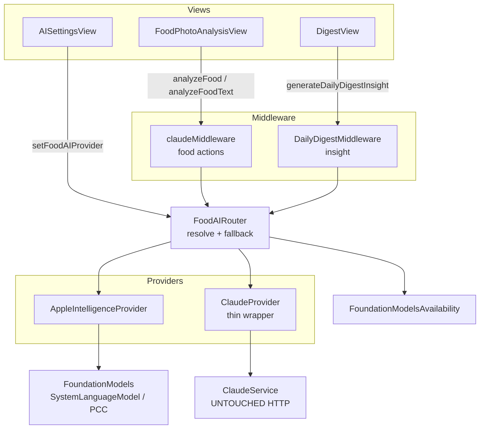
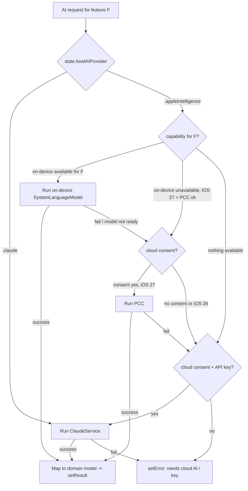

# feat: On-device Apple Intelligence for food AI — provider swap (local → PCC → Claude)

## Summary

Introduce a provider abstraction for the app's three AI features (NL food parsing, food-photo analysis, daily-digest insight) so they can run on **on-device Apple Foundation Models** and **Private Cloud Compute (PCC)** in addition to the existing **Claude/Anthropic HTTP** path. Selection is a user setting that **defaults to Claude** and only offers the Apple Intelligence path on capable OS/hardware. The existing `ClaudeService` HTTP path stays **byte-for-byte intact** and is the fallback at the bottom of the resolution chain.

The work is gated by two spikes the issue requires first: **re-verifying the dated iOS 27 beta constraints** against the then-current beta/RC, and a **parsing-quality feasibility comparison** of the on-device model vs Claude on real meals. Implementation is phased: **Phase A** ships the on-device *text* slice (works today on the iPhone 15 Pro under iOS 26) behind the toggle; **Phase B** adds on-device *image* input and PCC, both gated behind `#available(iOS 27, *)` and capability checks. **No deployment-target bump** — iOS 27 features are `#available`-guarded; the app stays on iOS 26.

This document is the `/ce-plan` artifact required by the issue's acceptance list ("Provider abstraction planned via `/ce-plan`").

---

## Problem Frame

Today every AI feature calls one concrete dependency:

- `analyzeFood` / `analyzeFoodText` → `ClaudeService` (HTTP) via `claudeMiddleware` (`App/Modules/Claude/ClaudeMiddleware.swift`), gated on `aiConsentFoodPhoto`.
- Daily digest insight → `ClaudeService.generateDigestInsight` called directly from `App/Modules/DailyDigest/DailyDigestMiddleware.swift`, gated on `aiConsentDailyDigest`.
- Barcode lookup → Open Food Facts (free, offline, **not** Claude — out of scope here).

Every path needs an Anthropic API key in Keychain and a network round-trip. WWDC 2026 (2026-06-08) shipped the APIs that make an on-device / PCC alternative concrete: Foundation Models gained image input and a provider protocol (`LanguageModel` / `LanguageModelSession`), `@Generable` structured output maps cleanly onto the app's `NutritionEstimate` / `DigestInsight` types, and PCC offers a key-free private cloud tier. The opportunity is **privacy** (on-device leaves nothing the device), **zero-cost** (no API key, no metered spend), and **resilience** (works without the user configuring a key).

The brainstorm deferred this as Track C precisely because the constraints are dated and fragile: device tiers, OS availability, and the protocol shape "historically shift between June betas and release." So the plan must lead with verification, prove quality before committing UX, and keep Claude as the safe default.

**Carried-forward constraints (see origin: `docs/brainstorms/2026-06-11-hig-wwdc26-adoption-requirements.md`):**
- R11 — one session interface, swappable backends (on-device → PCC → Claude), user-toggleable, Claude path untouched until this lands.
- R12 — first task is re-verifying the dated ("as of iOS 27 beta 1, 2026-06-08") constraints against the then-current beta/RC.

---

## Requirements & Traceability

| ID | Requirement | Source | Units |
|---|---|---|---|
| R11 | Provider abstraction: one call interface, swappable backends, user-toggleable; Claude path byte-for-byte intact | origin R11 | U3, U6, U7, U8, U9 |
| R12 | Re-verify dated iOS 27 constraints against current beta/RC before building | origin R12; AC1 | U1 |
| AC1 | Constraints re-verified against current iOS 27 beta/RC (dated 2026-06-08) | issue acceptance | U1 |
| AC2 | Feasibility spike: parsing quality of on-device model vs Claude on ~20 real meals (text; photos when hardware available) | issue acceptance | U2 |
| AC3 | Provider abstraction planned via `/ce-plan` (brainstorm → plan before implementation) | issue acceptance | this document |
| AC4 | Toggle ships with Claude as default until local quality is proven | issue acceptance | U3 (default), U7, U9 |

**Verified-this-session (2026-06-20, secondary sources — not a substitute for U1's first-party re-verification):** the WWDC26 sessions and follow-up coverage corroborate the broad shape — `SystemLanguageModel()` / `PrivateCloudComputeLanguageModel()` instances passed to `LanguageModelSession(model:)`, custom providers via SPM, `LanguageModelCapabilities`, `@Generable` from iOS 26, image input on-device in iOS 27. Sources **conflict** on specifics that materially affect this plan: the on-device context window (one source says 4K on iOS 27; the brainstorm cited 8K), the image-attachment API name (`Attachment()` in the brainstorm vs a `.image()` content block in coverage), and the exact device-RAM tier for on-device image input (the brainstorm's 12 GB / iPhone Air·17 Pro claim is not corroborated by a first-party source). These open conflicts are exactly what U1 must close.

---

## Key Technical Decisions

### KTD-1 — Introduce the app's own domain protocol, not Apple's `LanguageModel` directly

The app's call sites need **typed domain operations** — "food text → `NutritionEstimate`", "image → `NutritionEstimate`", "digest context → `DigestInsight`" — not a generic chat session. Define a small internal protocol (working name `FoodAIProviding`) with those three operations. Implementations:
- `ClaudeProvider` — a **thin wrapper** delegating to the existing, untouched `ClaudeService`.
- `AppleIntelligenceProvider` — uses `LanguageModelSession` over `SystemLanguageModel()` (on-device) or `PrivateCloudComputeLanguageModel()` (PCC) with `@Generable` output.

Apple's `LanguageModel` provider protocol lives *inside* `AppleIntelligenceProvider` as an implementation detail. This keeps the Claude HTTP path byte-for-byte intact (R11's hard constraint) while still giving us "one session interface." Adopting Apple's protocol *for Claude* via Anthropic's Swift package is a real future option but is deliberately **not** taken now (see Alternatives) because it would rewrite the working Claude path.

### KTD-2 — Resolve provider at point-of-use with a fallback chain, re-read from source of truth

A `FoodAIRouter` resolves the active provider per feature from `state.foodAIProvider` **and** runtime capability, applying the chain **local → PCC → Claude**. Because the user can flip the toggle mid-flight, the router re-reads the selection inside the async `Task` rather than trusting the dispatch-time `state` snapshot (see `docs/solutions/logic-errors/redux-middleware-async-task-pitfalls-20260420.md`). Fallback is **explicit and bounded** — each tier failure dispatches a typed result/error, never a sentinel string, to avoid the auto-retry loop documented in that same learning.

### KTD-3 — Default to Claude; only surface Apple Intelligence when capable

`state.foodAIProvider` defaults to `.claude` (AC4). The Settings picker offers `.appleIntelligence` **only** when `FoundationModelsAvailability` reports at least on-device text is available; otherwise the row is shown disabled with a reason ("Requires iPhone running iOS 26+ with Apple Intelligence"). Selecting Apple Intelligence on a device that later loses capability (e.g., model evicted) falls through the chain to Claude transparently.

### KTD-4 — Consent model: on-device is exempt; PCC and Claude are "cloud"

On-device inference (`SystemLanguageModel`, no network) leaves nothing the device, so the existing cloud-consent gates (`aiConsentFoodPhoto`, `aiConsentDailyDigest`) are **relaxed for the pure on-device path**. PCC sends data off-device to Apple's private cloud (no account, but still off-device) and Claude sends to Anthropic — both remain **behind the existing consent gates**. The router enforces consent at the tier it actually uses: an on-device run needs no cloud consent; a fallback that drops to PCC/Claude must respect the gate (and if consent is absent, stop at on-device or surface "enable cloud AI"). Whether PCC deserves its own distinct consent string vs. folding under the existing gate is an Open Question — default recommendation: fold under the existing gate with copy that names "Apple Private Cloud Compute" explicitly.

### KTD-5 — Phase the OS surface; no deployment-target bump

`import FoundationModels` and `@Generable` are available at the iOS 26 deployment target, so **Phase A (on-device text)** compiles and runs unguarded on iOS 26 — the early slice that works on the dev iPhone 15 Pro today. **Phase B (image input, PCC, provider protocol niceties)** is iOS 27 and is wrapped in `#available(iOS 27, *)` with an iOS-26 fallback branch (route to Claude). The 8 `IPHONEOS_DEPLOYMENT_TARGET` entries in `project.pbxproj` are **not** changed (see `docs/solutions/build-errors/ios-deployment-target-blocks-swift-api-cleanup-20260422.md`).

### KTD-6 — Provider code lives under `App/`, pure types under `Library/`

`AppleIntelligenceProvider` / `ClaudeProvider` / `FoodAIRouter` / `FoundationModelsAvailability` live under `App/Modules/` (they may touch `UIImage` and app-only APIs; extension targets are `NS_EXTENSION_UNAVAILABLE` — see `docs/solutions/best-practices/ios-26-uiscreen-main-migration-20260422.md`). The pure protocol and the `FoodAIProvider` selection enum live in `Library/` so the reducer/state and tests can reference them without app-only imports.

---

## High-Level Technical Design

### Component view



### Provider resolution & fallback (per request)



> Directional guidance for review — not an implementation specification. The per-feature capability gate differs: text food parsing needs only on-device text (iOS 26); photo analysis needs on-device image (iOS 27 + capable device); digest insight prefers PCC for its larger context, else on-device, else Claude.

### Async/Combine seam

Each middleware branch still returns a Combine `Future`; the router's async work is bridged with the **single-resume guard** from `docs/solutions/logic-errors/combine-future-async-bridge-double-resume-20260420.md`. Provider implementations are `async` throwing functions; the router awaits them and maps success/failure to the existing `.setFoodAnalysisResult` / `.setFoodAnalysisError` (food) and `.setDailyDigestInsight` / `.setDailyDigestInsightError` (digest) actions — no new result actions needed.

---

## Output Structure

New files cluster under one module folder (auto-synced by `fileSystemSynchronized`; no pbxproj edits except the test file):

```
App/Modules/AIProvider/
  FoodAIRouter.swift                 # provider resolution + fallback chain (U7)
  AppleIntelligenceProvider.swift    # Foundation Models on-device + PCC (U6, U8)
  ClaudeProvider.swift               # thin wrapper over existing ClaudeService (U7)
  FoundationModelsAvailability.swift # capability/availability gate (U4)
  GenerableModels.swift              # @Generable mirrors + domain mapping (U5)
Library/Content/
  FoodAIProvider.swift               # selection enum + FoodAIProviding protocol (U3)
DOSBTSTests/
  FoodAIRouterTests.swift            # routing + fallback + consent matrix (U7)
docs/solutions/best-practices/
  foundation-models-ios27-constraints-<date>.md  # U1 verification findings
```

`App/Modules/Claude/ClaudeService.swift` is **not** in this list — it stays untouched.

---

## Implementation Units

> Phase A = U1–U7 (verification, spike, abstraction, on-device text slice — runs on iOS 26). Phase B = U8 (iOS 27 image + PCC). U9 (Settings/consent) lands with Phase A and is extended in Phase B.

### U1. Re-verify iOS 27 / Foundation Models constraints against current beta/RC

**Goal:** Close the dated-constraint gaps (R12/AC1) with first-party verification before any code commits to an API shape.
**Requirements:** R12, AC1.
**Dependencies:** none (gates everything else).
**Files:** `docs/solutions/best-practices/foundation-models-ios27-constraints-<date>.md` (new findings doc).
**Approach:** Against the then-current Xcode/iOS beta or RC, confirm and record: (a) provider protocol surface — exact names and session-creation shape (`SystemLanguageModel`, `PrivateCloudComputeLanguageModel`, `LanguageModelSession(model:)`, capability declaration); (b) image-input API — `Attachment()` vs `.image()` content block, accepted input types, and the **device-RAM tier** that actually gates on-device image (the brainstorm's 12 GB / iPhone Air·17 Pro claim); (c) PCC — entitlement, network requirement, Small Business Program eligibility, context window; (d) on-device context window for iOS 26 vs 27 (resolve the 4K vs 8K conflict); (e) `@Generable` availability and any iOS 27 changes; (f) availability-check API (how to ask "is on-device text/image available right now"); (g) testing options given the dev device is an 8 GB iPhone 15 Pro (borrowed 12 GB device vs M-series Mac simulator for image tier). Update or annotate the brainstorm's dated bullets where reality diverged.
**Patterns to follow:** mirror the frontmatter + structure of existing `docs/solutions/best-practices/*.md`.
**Test scenarios:** Test expectation: none — research/verification spike; the deliverable is the findings doc.
**Verification:** Findings doc exists, each of (a)–(g) answered with a first-party citation or an explicit "could not verify on current beta — assume X, revisit," and the API names the rest of the plan depends on are pinned.

### U2. Feasibility spike — parsing-quality comparison (on-device vs Claude)

**Goal:** Prove (or disprove) on-device parsing quality on ~20 real meals before investing in UX (AC2).
**Requirements:** AC2.
**Dependencies:** U1 (need confirmed on-device API), U6 can be drafted in parallel but the spike needs a runnable on-device call.
**Files:** `App/Modules/Debug/` (extend the existing Debug module with a throwaway comparison harness) or a `DOSBTSTests` fixture set; `docs/solutions/best-practices/foundation-models-ios27-constraints-<date>.md` (append results).
**Approach:** Assemble ~20 representative food descriptions (and photos where 12 GB hardware/simulator is available) spanning the resolution cases in `ClaudeService.buildTextPrompt` (branded items, metric quantities, informal quantities, multi-item meals, ambiguous). Run each through both the on-device model and Claude; record carb estimate, item decomposition, confidence, and latency. Score against a hand-labelled ground truth (carbs within ±15% / ±35% bands mirroring the prompt's confidence definitions). Produce a **go/no-go** recommendation per feature (text now? photo when hardware allows? digest via PCC?).
**Execution note:** This is a measurement spike — its code is disposable; do not let harness scaffolding leak into shipping paths.
**Test scenarios:** Test expectation: none — exploratory spike; output is the recorded comparison + recommendation.
**Verification:** A results table for ≥20 text meals (photos noted as deferred if hardware unavailable) with a clear per-feature go/no-go; the recommendation is the gate for enabling each provider tier in U7/U8/U9.

### U3. Provider selection state + domain protocol

**Goal:** Add the user-selectable provider setting (default Claude) and the pure domain protocol both providers conform to.
**Requirements:** R11, AC4.
**Dependencies:** none (can precede U1's findings; the enum is provider-agnostic).
**Files:** `Library/Content/FoodAIProvider.swift` (new — `enum FoodAIProvider { case claude, appleIntelligence }` + `protocol FoodAIProviding`); `Library/DirectState.swift`; `App/AppState.swift`; `Library/Extensions/UserDefaults.swift`; `Library/DirectReducer.swift`; `Library/DirectAction.swift`.
**Approach:** Follow the CLAUDE.md "Adding New State Properties" 4-file recipe for a UserDefaults-backed `foodAIProvider` (default `.claude`), plus a `.setFoodAIProvider(_:)` action and reducer case. The `FoodAIProviding` protocol declares the three async operations (text, image, digest) returning the existing domain models. Keep the protocol free of app-only imports so it lives in `Library`.
**Patterns to follow:** existing consent flags (`aiConsentFoodPhoto`) for the 4-file recipe; `redux-state-coherence-reviewer` lockstep.
**Test scenarios:**
- Default value is `.claude` on a fresh `AppState(defaults:)` (use `makeTestDefaults()`).
- `.setFoodAIProvider(.appleIntelligence)` mutates state and persists to the injected defaults; reading back returns `.appleIntelligence`.
- Round-trip encode/decode of the enum's UserDefaults representation is stable.
- Covers R11. Reducer applies `.setFoodAIProvider` without touching unrelated state.
**Verification:** Build passes; new state survives the reducer/UserDefaults round-trip in tests; coherence review clean across the 5 lockstep files.

### U4. Foundation Models availability / capability gate

**Goal:** A single source of truth for "what can this device/OS do right now," driving routing and the Settings picker.
**Requirements:** R11, AC4.
**Dependencies:** U1 (confirmed availability API + tiers).
**Files:** `App/Modules/AIProvider/FoundationModelsAvailability.swift` (new).
**Approach:** Expose booleans `onDeviceTextAvailable`, `onDeviceImageAvailable`, `pccAvailable`, plus a human-readable reason when unavailable. Implement with `#available(iOS 26, *)` / `#available(iOS 27, *)` guards over the Foundation Models availability API confirmed in U1 (model readiness, device tier, Apple Intelligence enabled). Pure, synchronous, cheap to call from a view body and from the router. iOS 26 build path returns image/PCC = false.
**Patterns to follow:** iOS-26 migration availability handling (`docs/solutions/best-practices/ios-26-uiscreen-main-migration-20260422.md`); keep app-only APIs out of `Library`.
**Test scenarios:**
- On a stubbed "unavailable" environment, all flags are false and a reason string is returned.
- On a stubbed "on-device text only" environment, `onDeviceTextAvailable == true`, image/PCC false.
- The type is referenceable from a view without pulling in extension-unavailable symbols (compile-time).
- Edge: Apple Intelligence toggled off at OS level reports unavailable with the correct reason.
**Verification:** Unit tests for each stubbed capability combination pass; app + widget targets both still build.

### U5. `@Generable` model mapping

**Goal:** Structured-output mirror types for Foundation Models that convert to the existing `NutritionEstimate` / `NutritionItem` / `DigestInsight`, with schema parity to the Claude JSON path.
**Requirements:** R11.
**Dependencies:** U1 (confirmed `@Generable` shape).
**Files:** `App/Modules/AIProvider/GenerableModels.swift` (new).
**Approach:** Define `@Generable` structs whose fields match the Claude `nutritionSchema` / `textNutritionSchema` (name, carbs_g, protein_g, fat_g, calories, fiber_g, serving_size, confidence, confidence_notes, plus `reasoning` for the text path) and a `@Generable` digest-insight shape matching `DigestInsight` (headline, grade, facts[label/value/tone], tips, cheer). Provide `toNutritionEstimate()` / `toDigestInsight()` converters reusing the existing bounds-clamping semantics so HealthKit-bound values stay within the same limits the OFF/Claude paths enforce. Reuse `DigestInsight.parse` semantics for grade/tone validation.
**Patterns to follow:** existing `NutritionEstimate`/`DigestInsight` field set and clamping in `App/Modules/Claude/ClaudeMiddleware.swift` (`clampValue`/`clampCalories`/`clampFiber`); `DigestInsight.parse` lenient mapping.
**Test scenarios:**
- A populated `@Generable` nutrition value converts to a `NutritionEstimate` with identical fields and clamped out-of-range carbs/calories/fiber.
- Missing optional fields (protein/fat/calories) convert to `nil` without crashing.
- Digest mirror converts to a valid `DigestInsight`; invalid grade/tone strings fall back exactly as `DigestInsight.parse` does (max 3 facts, max 2 tips enforced).
- Edge: empty items array yields a zero-carb estimate, not a crash.
**Verification:** Conversion unit tests pass and assert field-for-field parity + clamping with the Claude path's expectations.

### U6. Apple Intelligence provider — on-device text (Phase A)

**Goal:** On-device NL food parsing via Foundation Models, the iOS 26 early slice.
**Requirements:** R11, AC4.
**Dependencies:** U1, U4, U5.
**Files:** `App/Modules/AIProvider/AppleIntelligenceProvider.swift` (new).
**Approach:** Implement `analyzeFoodText` with a `LanguageModelSession` over `SystemLanguageModel()`, prompting with the same resolution protocol / confidence definitions as `ClaudeService.buildTextPrompt`, requesting `@Generable` output (U5), converting to `NutritionEstimate`. Reuse the personal-food dictionary context and **the XML-escaping at the prompt boundary** from `docs/solutions/security-issues/xml-injection-ai-prompt-context-20260318.md` (the text/follow-up path still interpolates user food names). Image + PCC methods are present but throw `notAvailableOnThisOS` / route nowhere until U8. Honor the on-device context-window limit confirmed in U1 (trim personal-food/history context to fit; this is the main behavioral divergence from Claude's larger budget).
**Patterns to follow:** `ClaudeService.buildTextPrompt` prompt structure; `sanitizeFoodName` escaping; multi-turn `ConversationTurn` history handling.
**Test scenarios:**
- Given a `@Generable` stub returning a known structure, `analyzeFoodText` maps to the expected `NutritionEstimate` (logic testable by injecting a fake session/output).
- User food name containing `<`/`>` is escaped before entering prompt context (assert on the assembled prompt).
- History exceeding the on-device context budget is trimmed deterministically (oldest first) rather than overflowing.
- Error path: session throws → provider throws a typed error the router can catch (no sentinel).
- Edge: query < 3 chars with empty history throws the same validation error as the Claude path.
**Verification:** Unit tests pass with an injected fake model; manual on-device run on iPhone 15 Pro (iOS 26) returns a plausible estimate for a sample query (recorded in U2).

### U7. Claude provider wrapper + router wiring (Phase A)

**Goal:** Route the live food + digest actions through `FoodAIRouter` with the local→PCC→Claude chain, Claude wrapped (not modified).
**Requirements:** R11, AC4.
**Dependencies:** U3, U4, U6.
**Files:** `App/Modules/AIProvider/ClaudeProvider.swift` (new), `App/Modules/AIProvider/FoodAIRouter.swift` (new), `App/Modules/Claude/ClaudeMiddleware.swift` (route `.analyzeFood`/`.analyzeFoodText` branches through the router), `App/Modules/DailyDigest/DailyDigestMiddleware.swift` (route `generateDigestInsight` through the router), `DOSBTSTests/FoodAIRouterTests.swift` (new; add to `DOSBTSTests` group + `PBXSourcesBuildPhase`).
**Approach:** `ClaudeProvider` delegates verbatim to the existing `ClaudeService` methods. `FoodAIRouter` exposes one entry per feature; it re-reads `foodAIProvider` + capability + consent **inside** the async work (not from the captured snapshot — `redux-middleware-async-task-pitfalls`), runs the resolution/fallback of the HTD flowchart, and returns the domain model or a typed error. Middlewares keep returning a Combine `Future`; bridge async↔Combine with the single-resume guard. **Reducer-before-middleware:** do not guard the router on state the same action's reducer just changed (`middleware-race-condition-guard-blocks-api-call-Claude`). In Phase A the chain is effectively on-device-text→Claude (PCC branch is a no-op until U8). The existing `aiConsentFoodPhoto` / `aiConsentDailyDigest` guards stay, but become **tier-aware** per KTD-4 (on-device tier exempt).
**Patterns to follow:** existing `claudeMiddleware` Future structure; `LazyService` initialization; both **device + simulator** middleware arrays in `App.swift` only need re-touch if a *new* middleware is added — routing inside existing middlewares avoids that (confirm no new registration needed).
**Test scenarios:**
- Provider `.claude` → router calls `ClaudeProvider` only, regardless of capability.
- Provider `.appleIntelligence`, on-device text available, consent off → on-device runs (no consent needed), result returned.
- Provider `.appleIntelligence`, on-device fails, cloud consent on, key present → falls back to Claude exactly once (assert single Claude call, no loop).
- Provider `.appleIntelligence`, on-device unavailable, cloud consent off → typed "needs cloud AI" error, **no** Claude call.
- Mid-flight flip: snapshot says `.claude` but store updated to `.appleIntelligence` before await → router uses the re-read value (source of truth).
- Async bridge resumes the continuation exactly once on both success and failure (no double-resume crash).
- Digest routing mirrors the food matrix (consent gate = `aiConsentDailyDigest`).
- Covers R11. Claude path output is byte-identical to pre-change for `.claude` selection (characterization test).
**Execution note:** Add a characterization test pinning current Claude output shape **before** introducing the router, so the "Claude untouched" guarantee is enforced, not assumed.
**Verification:** Full routing/fallback/consent matrix passes; `.claude`-selected behavior is provably unchanged; app builds; both middleware arrays audited.

### U8. On-device image input + PCC routing (Phase B, iOS 27)

**Goal:** Add on-device photo analysis and the PCC tier, gated behind `#available(iOS 27, *)` and capability.
**Requirements:** R11.
**Dependencies:** U1 (image API + PCC entitlement), U4, U5, U6, U7; U2 go/no-go for image/PCC.
**Files:** `App/Modules/AIProvider/AppleIntelligenceProvider.swift` (image + PCC methods), `App/Modules/AIProvider/FoodAIRouter.swift` (enable PCC branch + per-feature policy), `App/Modules/AIProvider/FoundationModelsAvailability.swift` (image/PCC flags go live).
**Approach:** Implement `analyzeFood(imageData:)` using the confirmed image-attachment API (U1) over `SystemLanguageModel()` on capable devices, reusing the thumb-scale prompt hint and the recent-corrections context from `ClaudeService.buildPrompt`. Implement the PCC path via `PrivateCloudComputeLanguageModel()` for the digest insight (larger context suits the cross-day prompt) and as the middle fallback tier for text/photo when on-device is unavailable but cloud consent is granted. All iOS 27 symbols behind `#available(iOS 27, *)` with an iOS-26 branch that routes to Claude. Respect the PCC entitlement + network requirement from U1; if the entitlement is unavailable, treat PCC as unavailable (chain to Claude).
**Patterns to follow:** `ClaudeService.buildPrompt` (thumb scale, corrections, negative examples); `UIImage.preparedForVisionAPI` for input prep; U6's session/conversion structure.
**Test scenarios:**
- iOS 27 + image-capable device, provider `.appleIntelligence` → photo analyzed on-device, mapped to `NutritionEstimate`.
- iOS 26 (image flag false) → photo request routes to Claude (or PCC if consented), never calls the iOS 27 API.
- PCC digest path: on-device unavailable, consent on, iOS 27 → PCC runs; consent off → falls to on-device or Claude per chain.
- Image on an 8 GB device (on-device image unavailable) → chain to PCC/Claude with the correct reason; no crash.
- Entitlement missing → PCC reported unavailable, chain proceeds to Claude.
- Covers R11. Confirm widget/extension targets still build after introducing iOS 27 platform APIs.
**Verification:** Image + digest routing tests pass on stubbed capabilities; manual verification on a 12 GB device or M-series simulator (recorded in U2); iOS 26 fallback verified on the 15 Pro.

### U9. Settings picker + consent copy (Phase A; extended in Phase B)

**Goal:** User-facing provider selection with capability-aware presentation and accurate consent/privacy copy.
**Requirements:** R11, AC4.
**Dependencies:** U3, U4 (Phase A); U8 for image/PCC status (Phase B).
**Files:** `App/Views/Settings/AISettingsView.swift`.
**Approach:** Add a provider picker (segmented or list) bound to `.setFoodAIProvider`. The Apple Intelligence option is enabled only when `FoundationModelsAvailability.onDeviceTextAvailable`; otherwise shown disabled with the reason (dim per the Settings drill-down convention — `.disabled` + `.opacity`, not hidden). Show a short status line ("On-device · nothing leaves your iPhone" / "Falls back to Claude when on-device can't answer"). Update consent copy per KTD-4: clarify that on-device needs no cloud consent, and that PCC ("Apple Private Cloud Compute") and Claude do. Keep the Anthropic API key section and the existing consent toggles intact (Claude remains fully usable).
**Patterns to follow:** existing `AISettingsView` sections; `SettingsConnectionsView`/Integrations index conventions (DMNC-794); dim-don't-hide for gated controls; `dosNavigationTitle`.
**Test scenarios:**
- Picker reflects `state.foodAIProvider` and dispatches `.setFoodAIProvider` on change.
- When `onDeviceTextAvailable == false`, the Apple Intelligence row is disabled with the reason string and selecting it is impossible.
- Selecting Apple Intelligence then revoking cloud consent leaves on-device working and shows the right status.
- Accessibility: picker + status carry VoiceOver labels; ≥44pt targets (R1a-style floor).
- Test expectation note: view-logic scenarios above are unit-testable via the state mapping; pure layout is verified manually/snapshot.
**Verification:** Manual walkthrough on iOS 26 (text option live) and iOS 27 (image/PCC status live); picker state round-trips; CHANGELOG `[Unreleased]` gains a user-visible entry when the toggle ships.

---

## System-Wide Impact

- **Widget / Live Activity:** unaffected — no AI provider data surfaces there. Still build the widget target after U4/U8 introduce platform APIs (extension-unavailable risk), per `ios-26-uiscreen-main-migration-20260422.md`.
- **GRDB:** digest insight continues to persist via the existing `aiInsight` column through `DailyDigestMiddleware`; no schema change. Preserve the no-write-inside-asyncRead and resolve-Future-on-nil invariants (`grdb-write-inside-asyncread-deadlock-20260420.md`, `grdb-future-nil-dbqueue-hangs-subscriber-20260318.md`) — the router does not alter the store call sites' threading.
- **Tests:** new test file requires manual `DOSBTSTests` group + `PBXSourcesBuildPhase` entry (not auto-synced).
- **CHANGELOG:** the provider toggle is user-visible → `[Unreleased]` entry when Phase A ships.
- **Cost/privacy posture:** shifts metered Anthropic spend toward free on-device/PCC for users who opt in; Claude stays the default and the safety net.

---

## Risks & Mitigations

| Risk | Likelihood | Impact | Mitigation |
|---|---|---|---|
| iOS 27 API shape shifts between beta and RC (names, image attachment, PCC entitlement) | High | High | U1 gates all code; isolate Apple APIs inside `AppleIntelligenceProvider`; `#available` guards; Claude default means churn never breaks shipping behavior |
| On-device parsing quality below Claude | Medium | High | U2 spike with go/no-go before enabling per feature; Claude stays default until quality proven (AC4) |
| No 12 GB hardware for image testing (dev device is 8 GB 15 Pro) | High | Medium | Phase A (text) ships independent of image; image testing via borrowed 17 Pro or M-series simulator; image tier behind capability gate so absence is graceful |
| Fallback auto-retry loop / stale provider snapshot | Medium | High | Typed errors not sentinels; bounded single fallback per tier; re-read selection from source of truth inside Task (`redux-middleware-async-task-pitfalls`) |
| Async↔Combine double-resume crash | Medium | High | Single-resume guard (`combine-future-async-bridge-double-resume`) |
| Consent/privacy ambiguity for PCC (off-device but Apple-private) | Medium | Medium | KTD-4 consent model; explicit "Apple Private Cloud Compute" copy; PCC behind existing cloud gate by default (Open Question for a distinct gate) |
| Accidentally altering the Claude path | Low | High | `ClaudeService` untouched; `ClaudeProvider` is a pass-through wrapper; characterization test pins `.claude` output (U7) |

---

## Alternatives Considered

- **Adopt Apple's `LanguageModel` protocol for Claude too (via Anthropic's Swift package).** Cleanest "one session interface," and a strong future direction. Rejected for now because it would rewrite the working `ClaudeService` HTTP path, violating R11's byte-for-byte constraint and adding an SPM dependency to a vendored-deps project. Revisit once on-device/PCC are proven (would collapse `ClaudeProvider` onto the same session API).
- **Wait for iOS 27 GA (no Phase A).** Simpler, but forfeits the verified iOS 26 on-device text slice that runs on the dev device today and delays all learning. Rejected — phasing captures value early at low risk.
- **Per-feature scattered `if provider ==` branches in each middleware.** Less new code up front, but spreads capability/consent/fallback logic across call sites and regresses on the documented stale-state/sentinel pitfalls. Rejected in favor of the single `FoodAIRouter` (KTD-2).

---

## Scope Boundaries

**In scope:** provider abstraction + router; on-device text (Phase A) and on-device image + PCC (Phase B); provider toggle + consent copy; verification + feasibility spikes.

**Out of scope (non-goals):**
- The Open Food Facts barcode path — already key-free/offline; unchanged.
- Any change to `ClaudeService` behavior or the Anthropic HTTP contract.
- Deployment-target bump to iOS 27 (iOS 27 features are `#available`-guarded).
- Watch/widget AI surfaces.

### Deferred to Follow-Up Work
- Routing Claude through Apple's provider protocol + Anthropic SPM package (Alternatives).
- A dedicated PCC consent string, if the folded-gate default proves insufficient.
- Tool use (`BarcodeReaderTool` / `OCRTool`) if Foundation Models built-in tools are confirmed useful in U1.

---

## Open Questions

- **PCC consent granularity** — fold under the existing cloud-consent gate (recommended default) or add a distinct "Apple Private Cloud Compute" toggle? Privacy decision; confirm with maintainer before Phase B.
- **Per-feature default routing once Apple Intelligence is selected** — should digest *prefer* PCC over on-device given context size, while text/photo prefer on-device? Resolve with U2 quality + U1 context-limit findings.
- **On-device context budget vs personal-food dictionary size** — at 4K (if U1 confirms) the 50-entry dictionary + history may not fit; decide trimming policy (U6) once the real limit is known.
- **Quality bar to flip the default to Apple Intelligence** — what U2 result (e.g., ≥90% of meals within Claude's confidence band) would justify changing AC4's Claude default? Define the metric in U2.

---

## Sources & Research

- Origin brainstorm: `docs/brainstorms/2026-06-11-hig-wwdc26-adoption-requirements.md` (Track C, R11–R12, dated constraints).
- Code grounding (this session): `App/Modules/Claude/{ClaudeService,ClaudeMiddleware,ClaudeError,KeychainService}.swift`; `App/Modules/DailyDigest/DailyDigestMiddleware.swift`; `App/Views/Settings/AISettingsView.swift`; `App/Views/AddViews/{FoodPhotoAnalysisView,BarcodeScannerView}.swift`; `Library/Content/{NutritionEstimate,DigestInsight,PersonalFood,FoodCorrection}.swift`; state/action/reducer lockstep in `Library/DirectState.swift`, `Library/DirectAction.swift`, `Library/DirectReducer.swift`, `App/AppState.swift`, `Library/Extensions/UserDefaults.swift`; `App/App.swift` middleware arrays.
- Institutional learnings: `docs/solutions/logic-errors/middleware-race-condition-guard-blocks-api-call-Claude-20260313.md`, `redux-middleware-async-task-pitfalls-20260420.md`, `combine-future-async-bridge-double-resume-20260420.md`, `grdb-write-inside-asyncread-deadlock-20260420.md`, `grdb-future-nil-dbqueue-hangs-subscriber-20260318.md`; `docs/solutions/security-issues/redux-action-secret-leakage-keychain-side-channel.md`, `xml-injection-ai-prompt-context-20260318.md`; `docs/solutions/build-errors/ios-deployment-target-blocks-swift-api-cleanup-20260422.md`; `docs/solutions/best-practices/ios-26-uiscreen-main-migration-20260422.md`.
- WWDC 2026 (verify in U1 — secondary unless noted): [Session 241 — Foundation Models](https://developer.apple.com/videos/play/wwdc2026/241/), [Session 339 — Bring an LLM provider to Foundation Models](https://developer.apple.com/videos/play/wwdc2026/339/), [Session 319 — PCC](https://developer.apple.com/videos/play/wwdc2026/319/), [Session 237 — image understanding](https://developer.apple.com/videos/play/wwdc2026/237/). Coverage corroborating shape (and surfacing the 4K/8K and `Attachment()`/`.image()` conflicts U1 must resolve): dev.to provider-protocol write-up, byteiota, blakecrosley image-input post.
